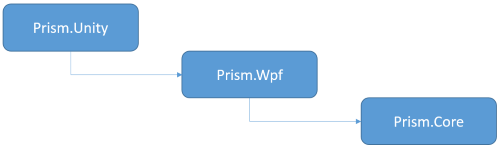

# Download and Setup Prism

Learn what’s included in Prism including the documentation, code samples, and libraries.  Additionally find out where to get the library and sample source code and the library NuGet packages.

For a list of the new features, bug fixes, and API changes, see the [release notes](https://github.com/PrismLibrary/Prism/wiki).

# Download and Setup the Prism Source Code

This section describes how to install Prism. It involves the following three steps:

-  Install system requirements.
-  Download and extract the Prism source code and documentation.
-  Compile and run the samples.

### Step 1: Install System Requirements 

Prism was designed to run on the Microsoft Windows 8 desktop, Microsoft Windows 7, Windows Vista, or Windows Server 2008 operating system. WPF applications built using this guidance require the .NET Framework 4.5.

Before you can use the Prism Library, the following must be installed:

-  Microsoft .NET Framework 4.5 or greater.
-  Microsoft Visual Studio 2012 or greater.
-  Xamarin for Visual Studio 3.11.1537 or greater.

### Step 2: Download and Extract the Prism Source Code and Documentation

The easiest way to download Prism source code, and documentation is to fork the [Prism repository](https://github.com/prismlibrary/prism).

You can download the source code, documentation, and samples for the Prism library from the following links:

-  [Prism Source Code and Documentation](https://github.com/PrismLibrary/Prism/releases)
-  Samples
    -  [WPF](https://github.com/PrismLibrary/Prism-Samples-Wpf)
    -  [Universal Windows Platform](https://github.com/PrismLibrary/Prism-Samples-Windows)
    -  [Xamarin.Forms](https://github.com/PrismLibrary/Prism-Samples-Forms)

_Optionally you can add the Prism assemblies directly to your projects by using the [NuGet packages](#nuget-packages)._

### Step 3: Compile and Run Samples

All samples use the Prism NuGet references so you can compile and run each solution directly.

# Adding Prism Library Source Projects to Solutions

As part of shipping the Prism Library as NuGet packages, the Prism Library projects were removed from the solutions of all sample projects. If you are a developer accustomed to stepping through the Prism Library code as you build your application, there are a couple of options:

-  **Add the Prism Library Projects back in**. To do this, right-click the solution, point to **Add**, and then click **Existing project**. Select the Prism Library projects. Then, to prevent inadvertently building these, click **Configuration Manager** on the **Build**
menu, and then clear the **Build** check box for all Prism Library projects in both the debug and release configurations.
-  **Set a breakpoint and step in**. Set a break point in your application's bootstrapper, and then step in to a method within the base class (F11 is the typical C\# keyboard shortcut for this). You may be asked to locate the Prism Library source code, but often, the full program database (PDB) file is available and the file will simply open. You may set breakpoints in any Prism Library project by opening the file and setting the breakpoint.

#NuGet Packages
### Core Packages

These are the base packages for each platform, together with the Prism's Core assembly as a cross-platform PCL.

| Platform | Assembly | Package | Version |
| -------- | -------- | ------- | ------- |
| PCL | Prism.dll | [Prism.Core][1] | [![21]][1] |
| WPF | Prism.Wpf.dll | [Prism.Wpf][2] | [![22]][2] |
| Xamarin.Forms | Prism.Forms.dll | [Prism.Forms][3] | [![23]][3] |
| Windows 10 UWP | Prism.Windows.dll | [Prism.Windows][4] | [![24]][4] |

### Container-specific packages

Each supported IoC container has its own package assisting in the setup and usage of that container together with Prism. The assembly is named using this convention: Prism.*Container.Platform*.dll, e.g. **Prism.Unity.Wpf.dll**. 

Following matrix shows the platform specific support currently available.

| Package                | Version    | WPF | Win10 UWP | Xamarin.Forms |
|------------------------|------------|:---:|:---:|:---:|
| [Prism.Unity][5] (*)   | [![25]][5] |  X  |  X  |     |
| [Prism.Unity.Forms][10]| [![30]][10]|     |     |  X  |
| [Prism.Mef][6]         | [![26]][6] |  X  |     |     |
| [Prism.Autofac][7]     | [![27]][7] |  X  |  X  |     |
| [Prism.StructureMap][8]| [![28]][8] |  X  |     |     |
| [Prism.Ninject][9]     | [![29]][9] |  X  |     |  X  |

(*) As Xamarin Forms also supports UWP now, adding Prism.Unity puts in some incorrect dependencies. Therefore we created a new Prism.Unity.Forms package. 

Note that adding the container-specific package to your project, will also pull in the correct platform-specific package and the core PCL library. E.g. when you'd like to use Unity in a WPF project, add the Prism.Unity package and the rest will be pulled in as well.

### Overview of assemblies

To recapitulate the packages described above, this is the list of all assemblies added to your solution by Prism 6 depending on the container and platform used.

######Prism PCL
| Assembly | Package |
| -------- | ------- |
| Prism.dll | [Prism.Core][1] |

######WPF
| Assembly | Package |
| -------- | ------- |
| Prism.Wpf.dll | [Prism.Wpf][2] |
| Prism.Unity.Wpf.dll | [Prism.Unity][5] |
| Prism.Mef.Wpf.dll | [Prism.Mef][6] |
| Prism.Autofac.Wpf.dll | [Prism.Autofac][7] |
| Prism.StructureMap.Wpf.dll | [Prism.StructureMap][8] |
| Prism.Ninject.Wpf.dll | [Prism.Ninject][9] |

######Xamarin.Forms
| Assembly | Package |
| -------- | ------- |
| Prism.Forms.dll | [Prism.Forms][3] |
| Prism.Unity.Forms.dll | [Prism.Unity][10] |
| Prism.Ninject.Forms.dll | [Prism.Ninject][9] |

######Universal Windows Platform
| Assembly | Package |
| -------- | ------- |
| Prism.Windows.dll | [Prism.Windows][4] |
| Prism.Unity.Windows.dll | [Prism.Unity][5] |
| Prism.Autofac.Windows.dll | [Prism.Autofac][7] |

[1]: https://www.nuget.org/packages/Prism.Core/
[2]: https://www.nuget.org/packages/Prism.Wpf/
[3]: https://www.nuget.org/packages/Prism.Forms/
[4]: https://www.nuget.org/packages/Prism.Windows/
[5]: https://www.nuget.org/packages/Prism.Unity/
[6]: https://www.nuget.org/packages/Prism.Mef/
[7]: https://www.nuget.org/packages/Prism.Autofac/
[8]: https://www.nuget.org/packages/Prism.StructureMap/
[9]: https://www.nuget.org/packages/Prism.Ninject/
[10]: https://www.nuget.org/packages/Prism.Unity.Forms/

[21]: https://img.shields.io/nuget/vpre/Prism.Core.svg
[22]: https://img.shields.io/nuget/vpre/Prism.Wpf.svg
[23]: https://img.shields.io/nuget/vpre/Prism.Forms.svg
[24]: https://img.shields.io/nuget/vpre/Prism.Windows.svg
[25]: https://img.shields.io/nuget/vpre/Prism.Unity.svg
[26]: https://img.shields.io/nuget/vpre/Prism.Mef.svg
[27]: https://img.shields.io/nuget/vpre/Prism.Autofac.svg
[28]: https://img.shields.io/nuget/vpre/Prism.StructureMap.svg
[29]: https://img.shields.io/nuget/vpre/Prism.Ninject.svg
[30]: https://img.shields.io/nuget/vpre/Prism.Unity.Forms.svg
