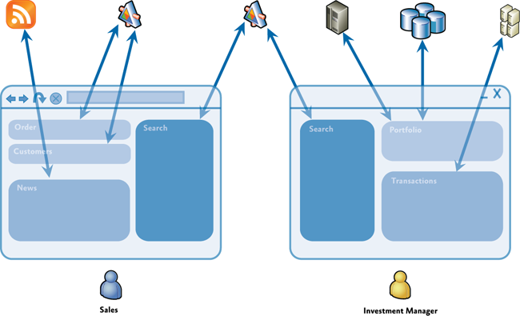
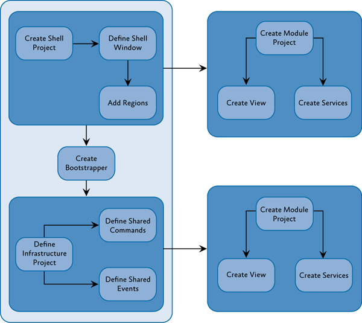
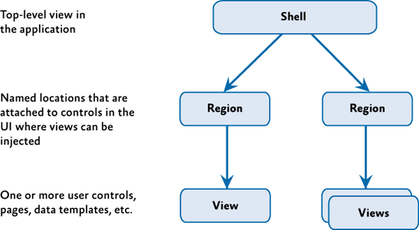
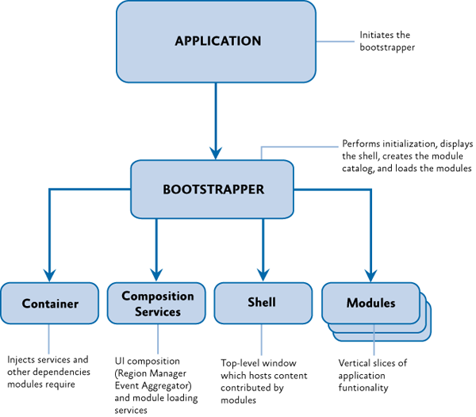

# Introduction to the Prism Library for WPF

Composite applications typically feature multiple screens, rich user interaction and data visualization, and that embody significant presentation and business logic. These applications typically interact with multiple back-end systems and services and, using a layered architecture, may be physically deployed across multiple tiers. It is expected that the application will evolve significantly over its lifetime in response to new requirements and business opportunities. In short, these applications are "built to last" and "built for change." Applications that do not demand these characteristics may not benefit from using Prism.

Prism includes reference implementations, QuickStarts, reusable library code (the Prism Library), and extensive documentation. This version of Prism targets the Microsoft .NET Framework 4.5 and includes new guidance around the Model-View-ViewModel (MVVM) pattern, navigation, and the Managed Extensibility Framework (MEF). Because Prism is built on the .NET Framework 4.5 (which includes WPF) , familiarity with these technologies is useful for evaluating and adopting Prism.

It should be noted that while Prism is not difficult to learn, developers must be ready and willing to embrace patterns and practices that may be new to them. Management understanding and commitment is crucial, and the project deadline must accommodate an investment of time up front for learning these patterns and practices.

### Why Use Prism?

Designing and building rich WPF client applications that are flexible and easy to maintain can be challenging. This section describes some of the common challenges you might encounter when building WPF client applications, and describes how Prism helps you to address those challenges.

### Client Application Development Challenges

Typically, developers of client applications face quite a few challenges. Application requirements can change over time. New business opportunities and challenges may present themselves, new technologies may become available, or even ongoing customer feedback during the development cycle may significantly affect the requirements of the application. Therefore, it is important to build the application so that it is flexible and can be easily modified or extended over time. Designing for this type of flexibility can be hard to accomplish. It requires an architecture that allows individual parts of the application to be independently developed and tested and that can be modified or updated later, in isolation, without affecting the rest of the application.

Most enterprise applications are sufficiently complex that they require more than one developer, maybe even a large team of developers that includes user interface (UI) designers and localizers in addition to developers. It can be a significant challenge to decide how to design the application so that multiple developers or subteams can work effectively on different pieces of the application independently, yet ensuring that the pieces come together seamlessly when integrated into the application.

Designing and building applications in a *monolithic* style can lead to an application that is very difficult and inefficient to maintain. In this case, "monolithic" refers to an application in which the components are very tightly coupled and there is no clear separation between them. Typically, applications designed and built this way suffer from problems that make the developer's life hard. It is difficult to add new features to the system or replace existing features, it is difficult to resolve bugs without breaking other portions of the system, and it is difficult to test and deploy. Also, it impacts the ability of developers and designers to work efficiently together.

### The Composite Approach

An effective remedy for these challenges is to partition the application into a number of discrete, loosely coupled, semi-independent components that can then be easily integrated together into an application "shell" to form a coherent solution. Applications designed and built this way are often known as composite applications.

Composite applications provide many benefits, including the following:

-  They allow modules to be individually developed, tested, and deployed by different individuals or subteams; they also allow them to be modified or extended with new functionality more easily, thereby allowing the application to be more easily extended and maintained. Note that even single-person projects experience benefits in creating more testable and maintainable applications using the composite approach.
-  They provide a common shell composed of UI components contributed from various modules that interact in a loosely coupled way. This reduces the contention that arises from multiple developers adding new functionality to the UI, and it promotes a common appearance.
-  They promote reuse and a clean separation of concerns between the application's horizontal capabilities, such as logging and authentication, and the vertical capabilities, such as business functionality that is specific to your application. This also allows you to more easily manage the dependencies and interactions between application components.
-  They help maintain a separation of roles by allowing different individuals or subteams to focus on a specific task or piece of functionality according to their focus or expertise. In particular, it provides a cleaner separation between the UI and the business logic of the application—this means the UI designer can focus on creating a richer user experience.

Composite applications are highly suited to a range of client application scenarios. For example, a composite application is ideal for creating a rich end-user experience over disparate back-end systems. The following illustration shows an example of this type of a composite application with multiple back-end systems.

In this type of application, the user can be presented with a rich and flexible user experience that provides a task-oriented focus over functionality that spans multiple back-end systems, services, and data stores, where each is represented by one or more dedicated modules. The clean separation between the application logic and the UI allows the application to provide a consistent and differentiated appearance across all constituent modules.

Additionally, a composite application can be useful when there are independently evolving components in the UI that heavily integrate with each other and that are often maintained by separate teams. The following illustration shows a screen shot of this type of application. Each of the areas highlighted represent independent components that are composed into the UI.

In this case, the composite application allows the UI to be dynamic composed. This delivers a flexible user experience. For example, it can allow new functionality to be dynamically added to the application at run time, which enables rich end-user customization and extensibility.

### Challenges Not Addressed by Prism

Although Prism helps you to address many of the challenges you might face when building WPF applications, there are many other challenges that you might face, depending on your application scenario and requirements. For example, Prism does not directly address the following topics:

-  Occasional connectivity and data synchronization
-  Service and messaging infrastructure design
-  Authentication and authorization
-  Application performance
-  Application versioning
-  Error handling and fault tolerance

### Prerequisites

Prism assumes you have hands-on experience with WPF . There are a few important concepts that Prism uses heavily, and you should become familiar with them. They include the following:

-   **XAML (Extensible Application Markup Language)**. The language to declaratively define and initialize the user interface in WPF applications.
-   **Data binding**. This is how UI elements are connected to components and data in WPF.
-   **Resources**. These are how styles, data templates, and control templates are created and managed in WPF.
-   **Commands**. These are how user gestures and input are connected to controls.
-   **User controls**. These are components that provide custom behavior or custom appearance.
-   **Dependency properties**. These are extensions to the common language runtime (CLR) property system to enable property setting and monitoring in support of data binding, routed commands, and events.
-   **Behaviors.** Behaviors are objects that encapsulate interactive functionality that can be easily applied to controls in the user interface.

### An Overview of Prism

#### Architectural Goals

The guidance is designed to help architects and developers achieve the following objectives:

-   Create an application from modules that can be built, assembled and, optionally, deployed by independent teams using WPF.
-   Minimize cross-team dependencies and allow teams to specialize in different areas, such as user interface (UI) design, business logic implementation, and infrastructure code development.
-   Use an architecture that promotes reusability across independent teams.
-   Increase the quality of applications by abstracting common services that are available to all the teams.
-   Incrementally integrate new capabilities.

#### Prism Design Goals

Prism was designed to help you design and build rich, flexible, and easy-to-maintain WPF applications. The Prism Library implements design patterns that embody important architectural design principles, such as separation of concerns and loose coupling. Using the design patterns and capabilities provided by the Prism Library, you can design and build applications using loosely coupled components that can evolve independently but that can be easily and seamlessly integrated into the overall application.

Prism is designed around the core architectural design principles of separation of concerns and loose coupling. This allows Prism to provide many benefits, including the following:

-   **Reuse**. Prism promotes reuse by allowing components and services to be easily developed, tested and integrated into one or more applications. Reuse can be achieved at the component level through the reuse of unit-tested components that can be easily discovered and integrated at run time through dependency injection, and at the application level through the use of modules that encapsulate application-level capabilities that can be reused across applications.
-   **Extensibility**. Prism helps to create applications that are easy to extend by managing component dependencies, allowing components to be more easily integrated or replaced with alternative implementations at run time, and by providing the ability to decompose an application into modules that can be independently updated and deployed. Many of the components in the Prism Library itself can also be extended or replaced.
-   **Flexibility**. Prism helps to create flexible applications by allowing them to be more easily updated as new capabilities are developed and integrated. Prism also allows WPF applications to be developed using common services and components, allowing the application to be deployed and consumed in the most appropriate way. It also allows applications to provide different experiences based on role or configuration.
-   **Team Development**. Prism promotes team development by allowing separate teams to develop and even deploy different parts of the application independently. Prism helps to minimize cross-team dependencies and allows teams to focus on different functional areas (such as UI design, business logic implementation, and infrastructure code development), or on different business-level functional areas (such as profile, sales, inventory, or logistics).
-   **Quality**. Prism can help to increase the quality of applications by allowing common services and components to be fully tested and made available to the development teams. In addition, by providing fully tested implementations of common design patterns, and the guidance needed to fully leverage them, Prism allows development teams to focus on their application requirements instead of implementing and testing infrastructure code.

It is important to note that Prism was designed so that you can use any of Prism's capabilities and design patterns individually, or all together, depending on your requirements and your application scenario. Prism was designed so that it could be incrementally adopted, allowing you to use the capabilities and design patterns that make sense for your particular application without requiring major structural changes.

Finally, because software testing should be considered a first-class development activity and tightly integrated into the development process, Prism provides extensive support for various types of software testing, thereby allowing you to design and build applications that are easy to test. Prism itself was developed with testing in mind. It was developed to meet multiple strict quality gates to ensure that it meets Microsoft security standards and that it will function correctly on multiple operating systems, with multiple versions of Visual Studio, and with multiple programming languages. Unit tests were run after each check-in. In addition, the Prism library was tested against several additional quality gates, as listed in the following table.

| Test                           | Description                                                                                                                                           |
|--------------------------------|-------------------------------------------------------------------------------------------------------------------------------------------------------|
| Acceptance Testing             | Validates the application functionality using user scenarios to drive the test requirements. Tests can be executed manually or automated.             |
| Application Building Exercises | Team members build applications consuming the deliverable software.                                                                                   |
| Black Box Testing              | Manual acceptance tests perform from the user point of view.                                                                                          |
| Cross Platform Testing         | All automated tests are run on multiple platforms.                                                                                                    |
| Globalization Testing          | All automated tests are run on multiple languages.                                                                                                    |
| Performance Testing            | Measures how fast a particular aspect of a system performs under-load.                                                                                |
| Security Review                | Internal Microsoft security audit standards that cover thread models, identifying attack factors and running the code though security analysis tools. |
| Stress Testing                 | Measures stability of the system under extreme loads; specifically looking to drive out issues like memory leaks and threading issues.                |
| White Box Testing              | In-depth source code analysis validating the coding standards, structure and how it maps to the overall architecture.                                 |

The Prism Library source code includes unit and UI automation tests, as shown in the following table. You can use these as an educational resource, or you can run the tests against the Prism Library itself. This allows you to customize, re-compile, test and deploy a modified version of the Prism Library using similar quality gates as the Prism team.

| Test                | Description                                                                            |
|---------------------|----------------------------------------------------------------------------------------|
| UI Automation Tests | Limited range of acceptance testing; driving the application from the user perspective |
| Unit Tests          | Validates the implementation of a class                                                |

#### Prism Key Concepts

Prism provides capabilities and design patterns that may be unfamiliar to you, especially if you're new to design patterns and composite application development. This section provides a brief overview of the main concepts behind Prism and defines some of the terminology that you will see used throughout the documentation and code.

-  **Modules**. Modules are packages of functionality that can be independently developed, tested, and (optionally) deployed. In many situations, modules are developed and maintained by separate teams. A typical Prism application is built from multiple modules. Modules can be used to represent specific business-related functionality (for example, profile management) and encapsulate all the views, services, and data models required to implement that functionality. Modules can also be used to encapsulate common application infrastructure or services (for example, logging and exception management services) that can be reused across multiple applications.
-  **Module catalog**. In a composite application, modules must be discovered and loaded at run time by the host application. In Prism, a module catalog is used to specify which modules to are to be loaded, when they are loaded, and in what order. The module catalog is used by the **ModuleManager** and **ModuleLoader** components, which are responsible for downloading the modules if they are remote, loading the module's assemblies into the application domain, and for initializing the module. Prism allows the module catalog to be specified in different ways, including programmatically using code, declaratively using XAML, or using a configuration file. You can also implement a custom module catalog if you need to.
-  **Shell**. The shell is the host application into which modules are loaded. The shell defines the overall layout and structure of the application, but it is typically unaware of the exact modules that it will host. It usually implements common application services and infrastructure, but most of the application's functionality and content is implemented within the modules. The shell also provides the top-level window or visual element that will then host the different UI components provided by the loaded modules.
-  **Views**. Views are UI controls that encapsulate the UI for a particular feature or functional area of the application. Views are used in conjunction with the MVVM pattern, which is used to provide a clean separation of concerns between the UI and the application's presentation logic and data. Views are used to encapsulate the UI and define user interaction behavior, thereby allowing the view to be updated or replaced independently of the underlying application functionality. Views use data binding to interact with view model classes.
-  **View models**. View models are classes that encapsulate the application's presentation logic and state. They are part of the MVVM pattern. View models encapsulate much of the application's functionality. View models define properties, commands, and events, to which controls in the view can data-bind.
-  **Models**. Model classes encapsulate the application data and business logic. They are used as part of the MVVM pattern. Models encapsulate data and any associated validation and business rules to ensure data consistency and integrity.
-  **Commands**. Commands are used to encapsulate application functionality in a way that allows them to be defined and tested independently of the application's UI. They can be defined as command objects or as command methods in the view model. Prism provides the -  - -  **DelegateCommand** class and the **CompositeCommand** class. The latter is used to represent a collection of commands which are all invoked together.
-  **Regions**. Regions are logical placeholders defined within the application's UI (in the shell or within views) into which views are displayed. Regions allow the layout of the application's UI to be updated without requiring changes to the application logic. Many common controls can be used as a region, allowing views to be automatically displayed within controls, such as a **ContentControl**, **ItemsControl**, **ListBox**, or **TabControl**. Views can be displayed within a region programmatically or automatically. Prism also provides support for implementing navigation with regions. Regions can be located by other components through the **RegionManager** component, which uses **RegionAdapter** and **RegionBehavior** components to coordinate the display of views within specific regions.
-  **Navigation**. Navigation is defined as the process by which the application coordinates changes to its UI as a result of the user's interaction with the application or internal application state changes. Prism supports two styles of navigation: state-based navigation, where the state of an existing view is updated to implement simple navigation scenarios, and view-switching navigation, where new views are created and old views replaced within the application's UI. View-switching navigation uses a Uniform Resource Identifier (URI)–based navigation mechanism in conjunction with Prism regions to allow flexible navigation schemes to be implemented.
-  **EventAggregator**. Components in a composite application often need to communicate with other components and services in the application in a loosely coupled way. To support this, Prism provides the **EventAggregator** component, which implements a pub-sub event mechanism, thereby allowing components to publish events and other components to subscribe to those events without either of them requiring a reference to the other. The **EventAggregator** is often used to allow components defined in different modules to communicate with each other.
-  **Dependency injection container**. The Dependency Injection (DI) pattern is used throughout Prism to allow the dependencies between components to be managed. Dependency injection allows component dependencies to be fulfilled at run time, and it supports extensibility and testability. Prism is designed to work with Unity or MEF, or with any other dependency injection containers via the **ServiceLocator**.
-  **Services**. Services are components that encapsulate non-UI related functionality, such as logging, exception management, and data access. Services can be defined by the application or within a module. Services are often registered with the dependency injection container so that they can be located or constructed as required and used by other components that depend on them.
-  **Controllers**. Controllers are classes that are used to coordinate the construction and initialization of views that are to be displayed in a region within the application's UI. Controllers encapsulate the presentation logic that determines which views are to be displayed. The controller will use Prism's view-switching navigation mechanism, which provides an extensible URI-based navigation mechanism to coordinate the construction and placement of views within regions. The Application Controller pattern defines an abstraction that maps to this responsibility.
-  **Bootstrapper**. The **Bootstrapper** component is used by the application to initialize the various Prism components and services. It is used to initialize the dependency injection container to register any application-level components and services with it. It is also used to configure and initialize the module catalog and the shell's view and view model or presenter.

Prism is designed so that you can use any of the preceding capabilities and design patterns individually, or all together, depending on your requirements and your application scenario. You can use the MVVM pattern, modularity, regions, commands, or events in any combination without having to adopt all of them. Of course, if you want to take full advantage of the benefits that separation of concerns and loose coupling offers, you will typically use many of Prism's capabilities and design patterns in conjunction with each other. The following illustration shows a typical Prism application architecture and shows how all the various capabilities of Prism can work together within a multi-module composite application.

**Typical composite application architecture with the Prism Library**

Most Prism applications consist of a shell application that defines regions for displaying top-level views and shared services that can be accessed by the loaded modules. The shell defines a suitable catalog to specify which modules are to be loaded at startup time , as appropriate. A dependency injection container is also defined, which allows component dependencies to be fulfilled at run time. Shared services and components are registered with the container by the **Bootstrapper** when the application starts.

Individual modules encapsulate a portion of the overall application's functionality and, using a separated presentation pattern such as MVVM, define views, view models, models, and service components. When the modules are loaded, views defined within the modules are displayed within the regions defined by the shell. After initialization completes, the user then navigates within the application using state-based or view-switching navigation to coordinate the visual update or display of new views within the application's regions.

# Using Prism

Now that you've seen the major capabilities and design patterns that Prism supports, it's time to see how easily you can start to use Prism when developing a new application. This section provides an overview of the first few steps required to create a basic Prism application. You can extend this basic application to leverage the additional capabilities and design patterns provided by Prism, as required by your scenario.

**Note:** _Although the Prism Library can be easily used to build new composite WPF applications, you can also use Prism with existing applications that want to take advantage of one or more Prism capabilities or design patterns._

A Prism application typically consists of a shell project and multiple module projects. The following illustration shows common activities needed when developing a composite application using the Prism Library.

**Activities for creating a composite application**

A typical Prism application leverages most or all of the Prism capabilities and design patterns described earlier to be able to fully realize the benefits of the loose coupling and separation of concerns architectural design principles. However, for this example, the steps required to create a basic Prism application that consists of a single module that defines a single view are described.

**Note:** _Most of your projects will need to reference the Prism Library assemblies. Prism provides signed binaries through NuGet packages so that you can use the Visual Studio **Manage NuGet Packages** dialog box to add references to them. You can also include the Prism Library projects in your solution and then use project references to them. The latter has the advantage of being able to use features like Go To Definition to step down into the Prism types, as well as being able to build and sign the Prism Library assemblies with your own strong name or certificate as part of your build process._

### Define the Shell

The application shell provides the basic layout for the application. This layout is defined using regions that modules can use to place views. Views, like shells, can use regions to define discoverable areas that content can be added to, as shown in the following illustration. Shells typically set the appearance for the entire application and contain the styles that are used throughout the application.

### Create the Bootstrapper

The bootstrapper is the glue that connects the application with the Prism Library services and the Unity or MEF containers. Each application creates an application-specific bootstrapper, which typically inherits from either **UnityBootstrapper** or **MefBootstrapper**, as shown in the following illustration. You will need to decide the approach you want to use to populate the module catalog. Minimally, each application will provide a module catalog and a shell.

By default, the bootstrapper logs events using the .NET Framework **Trace** class. Most applications will want to supply their own logging services, such as Enterprise Library logging. Applications can supply their logging service in their bootstrapper.

By default, the **UnityBootstrapper** and **MefBootstrapper** enable the Prism Library services. These can be disabled or replaced in your application-specific bootstrapper.
    

Diagram demonstrating connecting to the Prism Library.

### Create the Module

The module contains the views and services specific to a piece of the application's functionality. Frequently, these are contained in separate assemblies and developed by separate teams. A module is denoted by a class that implements the **IModule** interface. These modules, during initialization, register their views and services and may add one or more views to the shell. Depending on your module discovery approach, you may need to apply attributes to your module classes or define dependencies between your modules.

### Add a Module View to the Shell

Modules take advantage of the shell's regions for placing content. During initialization, modules use the **RegionManager** to locate regions in the shell and add one or more views to those regions or register one or more view types to be created within those regions. The **RegionManager** is responsible for keeping track of regions throughout the application and is a core service initialized from the bootstrapper.

The remaining topics in the documentation provide details about Prism key concepts.
