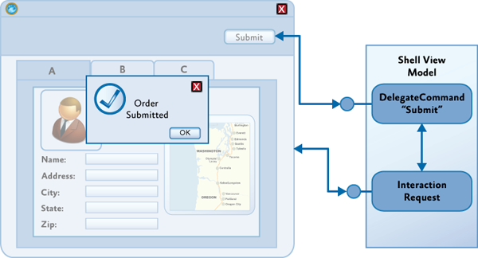

# Advanced MVVM Scenarios Using the Prism Library for WPF

The previous topic described how to implement the basic elements of the Model-View-ViewModel (MVVM) pattern by separating your application's user interface (UI), presentation logic, and business logic into three separate classes (the view, view model, and model), implementing the interactions between those classes (through data binding, commands, and data validation interfaces), and by implementing a strategy to handle construction and wire-up. This topic describes some sophisticated scenarios and describes how the MVVM pattern can support them. The next section describes how commands can be chained together or associated with child views and how they can be extended to support custom requirements. The following sections then describe how to handle asynchronous data requests and subsequent UI interactions and how to handle interaction requests between the view and the view model.

The section, [Advanced Construction and Wire-Up](45-AdvancedMVVMScenarios.md#advanced-construction-and-wire-up), provides guidance on handling construction and wire-up when using a dependency injection container, such as the Unity Application Block (Unity), or when using the Managed Extensibility Framework (MEF). The final section describes how you can test MVVM applications by providing guidance on unit testing your application's view model and model classes, and on testing behaviors.

## Commands

Commands provide a way to separate the command's implementation logic from its UI representation. Data binding or behaviors provide a way to declaratively associate elements in the view with commands proffered by the view model. The section, [Commands](40-ImplementingtheMVVMPattern.md#commands) in [Implementing the MVVM Pattern](40-ImplementingtheMVVMPattern.md), described how commands can be implemented as command objects or command methods on the view model, and how they can be invoked from controls in the view by using the built-in **Command** property provided by certain controls.

**WPF Routed Commands**: It should be noted that commands implemented as command objects or command methods in the MVVM pattern differ somewhat from WPF's built-in implementation of commands named routed commands. WPF routed commands deliver command messages by routing them through elements in the UI tree (specifically the [logical tree](https://msdn.microsoft.com/en-us/library/ms753391.aspx)). Therefore, command messages are routed up or down the UI tree from the focused element or to an explicitly specified target element; by default, they are not routed to components outside of the UI tree, such as the view model associated with the view. However, WPF-routed commands can use a command handler defined in the view's code-behind to forward the command call to the view model class.

### Composite Commands

In many cases, a command defined by a view model will be bound to controls in the associated view so that the user can directly invoke the command from within the view. However, in some cases, you may want to be able to invoke commands on one or more view models from a control in a parent view in the application's UI.

For example, if your application allows the user to edit multiple items at the same time, you may want to allow the user to save all the items using a single command represented by a button in the application's toolbar or ribbon. In this case, the **Save All** command will invoke each of the **Save** commands implemented by the view model instance for each item as shown in the following illustration.


Prism supports this scenario through the **CompositeCommand** class.

The **CompositeCommand** class represents a command that is composed from multiple child commands. When the composite command is invoked, each of its child commands is invoked in turn. It is useful in situations where you need to represent a group of commands as a single command in the UI or where you want to invoke multiple commands to implement a logical command.

For example, the **CompositeCommand** class is used in the Stock Trader Reference Implementation (Stock Trader RI) in order to implement the **SubmitAllOrders** command represented by the **Submit All** button in the buy/sell view. When the user clicks the **Submit All** button, each **SubmitCommand** defined by the individual buy/sell transactions is executed.

The **CompositeCommand** class maintains a list of child commands (**DelegateCommand** instances). The **Execute** method of the **CompositeCommand** class simply calls the **Execute** method on each of the child commands in turn. The **CanExecute** method similarly calls the **CanExecute** method of each child command, but if any of the child commands cannot be executed, the **CanExecute** method will return **false**. In other words, by default, a **CompositeCommand** can only be executed when all the child commands can be executed.

#### Registering and Unregistering Child Commands

Child commands are registered or unregistered using the **RegisterCommand** and **UnregisterCommand** methods. In the Stock Trader RI, for example, the **Submit** and **Cancel** commands for each buy/sell order are registered with the **SubmitAllOrders** and **CancelAllOrders** composite commands, as shown in the following code example (see the **OrdersController** class).

```
// OrdersController.cs
commandProxy.SubmitAllOrdersCommand.RegisterCommand(
                        orderCompositeViewModel.SubmitCommand );
commandProxy.CancelAllOrdersCommand.RegisterCommand(
                        orderCompositeViewModel.CancelCommand );
```

_**Note:** The preceding **commandProxy** object provides instance access to the **Submit** and **Cancel** composite commands, which are defined statically. For more information, see the class file StockTraderRICommands.cs._

#### Executing Commands on Active Child Views

Often, your application will need to display a collection of child views within the application's UI, where each child view will have a corresponding view model that, in turn, may implement one or more commands. Composite commands can be used to represent the commands implemented by child views within the application's UI and help to coordinate how they are invoked from within the parent view. To support these scenarios, the Prism **CompositeCommand** and **DelegateCommand** classes have been designed to work with Prism regions.

Prism regions (described in section, [Regions](50-ComposingtheUserInterface.md#regions), in [Composing the User Interface](50-ComposingtheUserInterface.md)) provide a way for child views to be associated with logical placeholders in the application's UI. They are often used to decouple the specific layout of child views from their logical placeholder and its position in the UI. Regions are based on named placeholders that are attached to specific layout controls. The following illustration shows an example where each child view has been added to the region named **EditRegion**, and the UI designer has chosen to use a **Tab** control to lay out the views within that region.


Composite commands at the parent view level will often be used to coordinate how commands at the child view level are invoked. In some cases, you will want the commands for all shown views to be executed, as in the **Save All** command example described earlier. In other cases, you will want the command to be executed only on the active view. In this case, the composite command will execute the child commands only on views that are deemed to be active; it will not execute the child commands on views that are not active. For example, you may want to implement a **Zoom** command on the application's toolbar or ribbon that causes only the currently active item to be zoomed, as shown in the following diagram.


To support this scenario, Prism provides the **IActiveAware** interface. The **IActiveAware** interface defines an **IsActive** property that returns **true** when the implementer is active, and an **IsActiveChanged** event that is raised whenever the active state is changed.

You can implement the **IActiveAware** interface on child views or view models. It is primarily used to track the active state of a child view within a region. Whether or not a view is active is determined by the region adapter that coordinates the views within the specific region control. For the **Tab** control shown earlier, there is a region adapter that sets the view in the currently selected tab as **active**, for example.

The **DelegateCommand** class also implements the **IActiveAware** interface. The **CompositeCommand** can be configured to evaluate the active status of child **DelegateCommands** (in addition to the **CanExecute** status) by specifying **true** for the **monitorCommandActivity** parameter in the constructor. When this parameter is set to **true**, the **CompositeCommand** class will consider each child **DelegateCommand**'s active status when determining the return value for the **CanExecute** method and when executing child commands within the **Execute** method.

When the **monitorCommandActivity** parameter is **true**, the **CompositeCommand** class exhibits the following behavior:

- **CanExecute**. Returns **true** only when all active commands can be executed. Child commands that are inactive will not be considered at all.
- **Execute**. Executes all active commands. Child commands that are inactive will not be considered at all.

You can use this functionality to implement the example described earlier. By implementing the **IActiveAware** interface on your child view models, you will be notified when your child view becomes active or inactive with the region. When the child view's active status changes, you can update the active status of the child commands. Then, when the user invokes the **Zoom** composite command, the **Zoom** command on the active child view will be invoked.

### Commands Within Collections

Another common scenario you will often encounter when displaying a collection of items in a view is when you need the UI for each item in the collection to be associated with a command at the parent view level (instead of the item level).

For example, in the application shown in the following illustration, the view displays a collection of items in a **ListBox** control, and the data template used to display each item defines a **Delete** button that allows the user to delete individual items from the collection.


Because the view model implements the **Delete** command, the challenge is to wire up the **Delete** button in the UI for each item, to the **Delete** command implemented by the view model. The difficulty arises because the data context for each of the items in the **ListBox** references the item in the collection instead of the parent view model that implements the **Delete** command.

One approach to this problem is to bind the button in the data template to the command in the parent view using the **ElementName** binding property to ensure that the binding is relative to the parent control and not relative to the data template. The following XAML illustrates this technique.

```
<Grid x:Name="root">
    <ListBox ItemsSource="{Binding Path=Items}">
        <ListBox.ItemTemplate>
            <DataTemplate>
                <Button Content="{Binding Path=Name}"
                    Command="{Binding ElementName=root, 
                    Path=DataContext.DeleteCommand}" />
            </DataTemplate>
        </ListBox.ItemTemplate>
    </ListBox>
</Grid>
```

The content of button control in the data template is bound to the **Name** property on the item in the collection. However, the command for the button is bound via the root element's data context to the **Delete** command. This allows the button to be bound to the command at the parent view level instead of at the item level. You can use the **CommandParameter** property to specify the item to which the command is to be applied, or you can implement the command to operate on the currently selected item (via a **CollectionView**).

## Interaction Triggers and Commands

An alternative approach to commands is to use Blend for Visual Studio 2013 interaction triggers and the **InvokeCommandAction** action.

```
<Button Content="Submit" IsEnabled="{Binding CanSubmit}">
    <i:Interaction.Triggers>
        <i:EventTrigger EventName="Click">
            <i:InvokeCommandAction Command="{Binding SubmitCommand}"/>
        </i:EventTrigger>
    </i:Interaction.Triggers>
</Button>
```

This approach can be used for any control to which you can attach an interaction trigger. It is especially useful if you want to attach a command to a control that does not implement the **ICommandSource** interface, or when you want to invoke the command on an event other than the default event. Again, if you need to supply parameters for your command, you can use the **CommandParameter** property.

The following shows how to use the Blend EventTrigger configured to listen to the ListBox’s **SelectionChanged** event. When this event occurs, the SelectedCommand is invoked by the **InvokeCommandAction**.

```
<ListBox ItemsSource="{Binding Items}" SelectionMode="Single">
    <i:Interaction.Triggers>
        <i:EventTrigger EventName="SelectionChanged">
            <i:InvokeCommandAction Command="{Binding SelectedCommand}" />
        </i:EventTrigger>
    </i:Interaction.Triggers>
</ListBox>
```

> **Command-Enabled Controls vs. Behaviors**

>WPF controls that support commands allow you to declaratively hook up a control to a command. These controls will invoke the specified command when the user interacts with the control in a specific way. For example, for a **Button** control, the command will be invoked when the user clicks the button. This event associated with the command is fixed and cannot be changed.

> Behaviors also allow you to hook up a control to a command in a declarative fashion. However, behaviors can be associated with a range of events raised by the control, and they can be used to conditionally invoke an associated command object or a command method in the view model. In other words, behaviors can address many of the same scenarios as command-enabled controls, and they may provide a greater degree of flexibility and control._

> You will need to choose when to use command-enabled controls and when to use behaviors, as well as which kind of behavior to use. If you prefer to use a single mechanism to associate controls in the view with functionality in the view model or for consistency, you might consider using behaviors, even for controls that inherently support commands.

> If you only need to use command-enabled controls to invoke commands on the view model, and if you are happy with the default events to invoke the command, behaviors may not be required. Similarly, if your developers or UI designers will not be using Blend for Visual Studio 2013, you may favor command-enabled controls (or custom attached behaviors) because of the additional syntax required for Blend behaviors.

#### Passing EventArgs Parameters to the Command

When you need to invoke a command in response to an event raised by a control located in the view, you can use Prism’s **InvokeCommandAction**. Prism’s **InvokeCommandAction** differs from the class of the same name in the Blend SDK in two ways. First, the Prism **InvokeCommandAction** updates the enabled state of the associated control based on the return value of the command’s **CanExecute** method. Second, the Prism **InvokeCommandAction** uses the **EventArgs** parameter passed to it from the parent trigger, passing it to the associated command if the **CommandParameter** is not set.

Sometimes you need to pass a parameter to the command that comes from the parent trigger, such as the **EventArgs** from the **EventTrigger**. In that  scenario you cannot use Blend’s **InvokeCommandAction** action. 

In the following code you can see that Prism’s **InvokeCommandAction** has a property called **TriggerParameterPath** that is used to specify the member (possibly nested) of the parameter passed as the command parameter. In the following example, the **AddedItems** property of the **SelectionChanged** EventArgs will be passed to the **SelectedCommand** command.

```
<ListBox Grid.Row="1" Margin="5" ItemsSource="{Binding Items}" SelectionMode="Single">
    <i:Interaction.Triggers>
        <i:EventTrigger EventName="SelectionChanged">
            <!-- This action will invoke the selected command in the view model and pass the parameters of the event to it. -->
            <prism:InvokeCommandAction Command="{Binding SelectedCommand}" TriggerParameterPath="AddedItems" />
        </i:EventTrigger>
    </i:Interaction.Triggers>
</ListBox>
```

## Handling Asynchronous Interactions

Your view model will often need to interact with services and components within your application that communicate asynchronously instead of synchronously. This is especially true if you interacting with web services or other resources over the network, or if your application uses background tasks to perform calculations or I/O. Performing these operations asynchronously ensures that your application remains responsive which is essential for delivering a good user experience.

When the user initiates an asynchronous request or background task, it is difficult to predict when the response will arrive (or even if it will arrive) and, very often, what thread it will return on. Because the UI can be updated only in the UI thread, you will often need to update the UI by dispatching a request on the UI thread.

### Retrieving Data and Interacting with Web Services

When interacting with web services or other remote access technologies, you will often encounter the **IAsyncResult** pattern. In this pattern, instead of invoking a method, such as **GetQuestionnaire**, you use the pair of methods **BeginGetQuestionnaire** and **EndGetQuestionnaire**. To initiate the asynchronous call, you call **BeginGetQuestionnaire**. To get the results or determine if there was an exception when invoking the target method, you call **EndGetQuestionnaire** when the call is complete.

To determine when to call **EndGetQuestionnaire**, you can either poll for completion or (preferably) specify a callback during the call to **BeginGetQuestionnaire**. With the callback approach, your callback method will be called when the execution of the target method is complete, allowing you to call **EndGetQuestionnaire** from there, as shown here.

```
IAsyncResult asyncResult = this.service.BeginGetQuestionnaire(GetQuestionnaireCompleted, null // object state, not used in this example);

private void GetQuestionnaireCompleted(IAsyncResult result)
{
    try
    {
        questionnaire = this.service.EndGetQuestionnaire(ar);
    }
    catch (Exception ex)
    {
        // Do something to report the error.
    }
}
```

It is important to note that in the calls to the **End** method (in this case, **EndGetQuestionnaire**), any exceptions that occurred during the execution of the request will be raised. Your application must handle these and may need to report them in a thread-safe way via the UI. If you do not handle these, the thread will end and you will not be able to process the results.

Because the response usually is not on the UI thread, if you plan to modify anything that will affect UI state, you will need to dispatch the response to the UI thread using either the thread **Dispatcher** or the **SynchronizationContext** objects. In WPF, you will commonly use the dispatcher.

In the following code example, the **Questionnaire** object is retrieved asynchronously, and then it is set as the data context for the **QuestionnaireView**. You can use the **CheckAccess** method of the dispatcher to see whether you are on the UI thread. If you are not, you will need to use the **BeginInvoke** method to have the request carried out on the UI thread.

```
var dispatcher = System.Windows.Deployment.Current.Dispatcher;
if (dispatcher.CheckAccess())
{
    QuestionnaireView.DataContext = questionnaire;
}
else
{
    dispatcher.BeginInvoke(
        () => { Questionnaire.DataContext = questionnaire; });
}
```

The Model-View-ViewModel Reference Implementation (MVVM RI) shows an example of how to consume an **IAsyncResult**-based service interface similar to the preceding examples. It also wraps the service to provide a simpler callback mechanism for the consumer and handles the dispatch of the callback to the caller's thread. For example, the following code example shows retrieval of the questionnaire.

```
this.questionnaireRepository.GetQuestionnaireAsync(
    (result) =>
    {
        this.Questionnaire = result.Result;
    });
```

The **result** object returned wraps the result retrieved in addition to errors that may have occurred. The following code example shows how the errors could be evaluated.

```
this.questionnaireRepository.GetQuestionnaireAsync(
    (result) =>
    {
        if (result.Error == null) 
        {
            this.Questionnaire = result.Result;
            ...
        }
        else
        {
            // Handle error.
        }
    })
```

## User Interaction Patterns

Frequently, an application needs to notify the user of the occurrence of an event or ask for confirmation before proceeding with an operation. These interactions are often brief interactions designed to simply inform them of a change in the application or to obtain a simple response from them. Some of these interactions may appear modal to the user, such as when displaying a dialog box or a message box, or they may appear non-modal to the user, such as when displaying a toast notification or a pop-up window.

There are multiple ways to interact with the user in these cases, but implementing them in an MVVM-based application in a way that preserves a clean separation of concerns can be challenging. For example, in a non-MVVM application, you would often use the **MessageBox** class in the UI's code-behind file to simply prompt the user for a response. In an MVVM application, this would not be appropriate because it would break the separation of concerns between the view and the view model.

In terms of the MVVM pattern, the view model is responsible for initiating an interaction with the user and for consuming and processing any response, while the view is responsible for actually managing the interaction with the user using whatever user experience is appropriate. Preserving the separation of concerns between the presentation logic implemented in the view model, and the user experience implemented by the view, helps to improve testability and flexibility.

There are two common approaches to implementing these kinds of user interactions in the MVVM pattern. One approach is to implement a service that can be used by the view model to initiate interaction with the user, thereby preserving its independence on the view's implementation. Another approach uses events raised by the view model to express the intent to interact with the user, along with components in the view that are bound to these events and that manage the visual aspects of the interaction. Each of these approaches is described in the following sections.

### Using an Interaction Service

In this approach, the view model relies on an interaction service component to initiate interaction with the user via a message box. This approach supports a clean separation of concerns and testability by encapsulating the visual implementation of the interaction in a separate service component. Typically, the view model has a dependency on an interaction service interface. It frequently acquires a reference to the interaction service's implementation via dependency injection or a service locator.

After the view model has a reference to the interaction service, it can programmatically request interaction with the user whenever necessary. The interaction service implements the visual aspects of the interaction, as shown in the following illustration. Using an interface reference in the view model allows for different implementations to be used, according to the implementation requirements of the user interface. For example, implementations of the interaction service for WPF could be provided, allowing for greater re-use of the application's presentation logic.


Modal interactions, such as where the user is presented with a **MessageBox** or modal pop-up window to obtain a specific response before execution can proceed, can be implemented in a synchronous way, using a blocking method call, as shown in the following code example.

```
var result = 
    interactionService.ShowMessageBox(
        "Are you sure you want to cancel this operation?",
        "Confirm",
        MessageBoxButton.OK );
if (result == MessageBoxResult.Yes)
{
    CancelRequest();
}
```

However, one of the disadvantages of this approach is that it forces a synchronous programming model. An alternative asynchronous implementation allows for the view model to provide a callback to execute on completion of the interaction. The following code illustrates this approach.

```
interactionService.ShowMessageBox(
    "Are you sure you want to cancel this operation?",
    "Confirm",
    MessageBoxButton.OK,
    result =>
    {
        if (result == MessageBoxResult.Yes)
        {
            CancelRequest();
        }
    });
```

The asynchronous approach provides greater flexibility when implementing the interaction service by allowing modal and non-modal interactions to be implemented. For example, in WPF, the **MessageBox** class can be used to implement a truly modal interaction with the user.

### Using Interaction Request Objects

Another approach to implementing simple user interactions in the MVVM pattern is to allow the view model to make interaction requests directly to the view itself via an interaction request object coupled with a behavior in the view. The interaction request object encapsulates the details of the interaction request, and its response, and communicates with the view via events. The view subscribes to these events to initiate the user experience portion of the interaction. The view will typically encapsulate the user experience of the interaction in a behavior that is data-bound to the interaction request object provided by the view model, as shown in the following illustration.



This approach provides a simple, yet flexible, mechanism that preserves a clean separation between the view model and the view—it allows the view model to encapsulate the application's presentation logic, including any required user interactions, while allowing the view to fully encapsulate the visual aspects of the interaction. The view model's implementation, including its expected interactions with the user through view, can be easily tested, and the UI designer has a lot of flexibility in choosing how to implement the interaction within the view via the use of different behaviors that encapsulate the different user experiences for the interaction.

This approach is consistent with the MVVM pattern, enabling the view to reflect state changes it observes on the view model and using two-way data binding for communication of data between the two. The encapsulation of the non-visual elements of the interaction in an interaction request object, and the use of a corresponding behavior to manage the visual elements of the interaction, are very similar to the way command objects and command behaviors are used.

This approach is the approach adopted by Prism. The Prism Library directly supports this pattern through the **IInteractionRequest** interface and the **InteractionRequest&lt;T&gt;** class. The **IInteractionRequest** interface defines an event to initiate the interaction. Behaviors in the view bind to this interface and subscribe to the event that it exposes. The **InteractionRequest&lt;T&gt;** class implements the **IInteractionRequest** interface and defines two **Raise** methods to allow the view model to initiate an interaction and to specify the context for the request, and optionally, a callback delegate.

#### Initiating Interaction Requests from the View Model

The **InteractionRequest&lt;T&gt;** class coordinates the view model's interaction with the view during an interaction request. The **Raise** method allows the view model to initiate the interaction and to specify a context object (of type **T**) and a callback method that is called after the interaction completes. The context object allows the view model to pass data and state to the view for it to be used during the interaction with the user. If a callback method was specified, the context object will be passed back to the view model; this allows any changes the user made during the interaction to be passed back to the view model.

```
public interface IInteractionRequest
{
    event EventHandler<InteractionRequestedEventArgs> Raised;
}

public class InteractionRequest<T> : IInteractionRequest
    where T : INotification
{
    public event EventHandler<InteractionRequestedEventArgs> Raised;

    public void Raise(T context)
    {
        this.Raise(context, c => { });
    }

    public void Raise(T context, Action<T> callback)
    {
        var handler = this.Raised;
        if (handler != null)
        {
            handler(
            this,
            new InteractionRequestedEventArgs(
                context,
                () => { if (callback != null) callback(context); } ));
        }
    }
}
```

Prism provides pre-defined context classes that support common interaction request scenarios. The **INotification** interface is used for all context objects. It is used when the interaction request is used to notify the user of an important event in the application. It provides two properties—**Title** and **Content**—which will be displayed to the user. Typically, notifications are one-way, so it is not expected that the user will change these values during the interaction. The **Notification** class is the default implementation of this interface.

The **IConfirmation** interface extends the **INotification** interface and adds a third property—**Confirmed**—which is used to signify that the user has confirmed or denied the operation. The **Confirmation** class, the provided **IConfirmation** implementation, is used to implement **MessageBox** style interactions where the user wants to obtain a yes/no response from the user. You can define a custom context class that implements the **INotification** interface to encapsulate whatever data and state you need to support the interaction.

To use the **InteractionRequest&lt;T&gt;** class, the view model class will create an instance of the **InteractionRequest&lt;T&gt;** class and define a read-only property to allow the view to data-bind against it. When the view model wants to initiate the request, it will call the **Raise** method, passing in the context object and, optionally, the callback delegate.

```
public InteractionRequestViewModel()
{
    this.ConfirmationRequest = new InteractionRequest<IConfirmation>();
    ...
    // Commands for each of the buttons. Each of these raise a different interaction request.
    this.RaiseConfirmationCommand = new DelegateCommand(this.RaiseConfirmation);
    ...
}

public InteractionRequest<IConfirmation> ConfirmationRequest { get; private set; }

private void RaiseConfirmation()
{
    this.ConfirmationRequest.Raise(
        new Confirmation { Content = "Confirmation Message", Title = "Confirmation" },
        c => { InteractionResultMessage = c.Confirmed ? "The user accepted." : "The user cancelled."; });
}
```

The [Interactivity QuickStart](https://msdn.microsoft.com/en-us/library/ff921081%28v=pandp.40%29.aspx) illustrates how the **IInteractionRequest** interface and the **InteractionRequest&lt;T&gt;** class are used to implement user interactions between the view and view model (see InteractionRequestViewModel.cs).

#### Using Behaviors to Implement the Interaction User Experience

Because the interaction request object represents a logical interaction, the exact user experience for the interaction is defined in the view. Behaviors are often used to encapsulate the user experience for an interaction; this allows the UI designer to choose an appropriate behavior and to bind it to the interaction request object on the view model.

The view must be set up to detect an interaction request event, and then to present the appropriate visual display for the request. Triggers are used to initiate actions whenever a specific event is raised.

The standard **EventTrigger** provided by Blend can be used to monitor an interaction request event by binding to the interaction request objects exposed by the view model. However, the Prism Library defines a custom **EventTrigger**, named **InteractionRequestTrigger**, which automatically connects to the appropriate **Raised** event of the **IInteractionRequest** interface. This reduces the amount of Extensible Application Markup Language (XAML) needed and reduces the chance of inadvertently entering an incorrect event name.

After the event is raised, the **InteractionRequestTrigger** will invoke the specified action. For WPF, the Prism Library provides the **PopupWindowAction** class, which displays a pop-up window to the user. When the window is displayed, its data context is set to the context parameter of the interaction request. Using the **WindowContent** property of the **PopupWindowAction** class, you can specify the view that will be shown in the popup window. The title of the pop-up window is bound to the Title property of the context object. 

_**Note:** By default, the specific type of pop-up window displayed by the **PopupWindowAction** class depends on the type of the context object. For a **Notification** context object, a **DefaultNotificationWindow** is displayed, while for a **Confirmation** context object, a **DefaultConfirmationWindow** is displayed. The **DefaultNotificationWindow** displays a simple popup window to display the notification, while the **DefaultConfirmationWindow** also contains **Accept** and **Cancel** buttons to capture the user's response. You can override this behavior by specifying a custom pop-up window using the **WindowContent** property of the **PopupWindowAction** class._

The following example shows how the **InteractionRequestTrigger** and the **PopupWindowAction** are used to display a confirmation pop-up window to the user within the Interactivity QuickStart.

```
<i:Interaction.Triggers>
    <prism:InteractionRequestTrigger SourceObject="{Binding ConfirmationRequest, Mode=OneWay}">
        <prism:PopupWindowAction IsModal="True" CenterOverAssociatedObject="True"/>
    </prism:InteractionRequestTrigger>
</i:Interaction.Triggers>
```

_**Note:** The **PopupWindowAction** has three important properties, **IsModal,** which sets the popup to modal when set to true; **CenterOverAssociatedObject**, which displays the popup centered to the parent window when set to true. Finally, the **WindowContent** property, which is not specified, therefore the **DefaultConfirmationWindow** will be shown._

The **PopupWindowAction** sets the **Notification** object as the data context of the **DefaultNotificationWindow**, which displays the **Content** property of the **Notification** object. After the user closes the pop-up window, the context object is passed back to the view model, along with any updated values, via the callback method. In the confirmation example in the Interactivity QuickStart, the **DefaultConfirmationWindow** is responsible for setting the **Confirmed** property on the supplied **Confirmation** object to **true** when the **OK** button is clicked.

Different triggers and actions can be defined to support other interaction mechanisms. The implementation of the Prism **InteractionRequestTrigger** and **PopupWindowAction** classes can be used as a basis for the development of your own triggers and actions.

## Advanced Construction and Wire-Up

To successfully implement the MVVM pattern, you will need to fully understand the responsibilities of the view, model, and view model classes so that you can implement your application's code in the correct classes. Implementing the correct patterns to allow these classes to interact (through data binding, commands, interaction requests, and so on) is also an important requirement. The final step is to consider how the view, view model, and model classes are instantiated and associated with each other at run time.

Choosing an appropriate strategy to manage this step is especially important if you are using a dependency injection container in your application. The Managed Extensibility Framework (MEF) and the Unity Application Block (Unity) both provide the ability to specify dependencies between the view, view model, and model classes and to have them fulfilled by the container at run time.

Typically, you define the view model as a dependency of the view, so that when the view is constructed (using the container) it automatically instantiates the required view model. In turn, any components or services that the view model depends on will also be instantiated by the container. After the view model is successfully instantiated, the view then sets it as its data context.

#### Creating the View and View Model Using MEF

Using MEF, you can specify the view's dependency on a view model using the **import** attribute, and you can specify the concrete view model type to be instantiated via an **export** attribute. You can either import the view model into the view via a property or as a constructor argument.

For example, the **Shell** view in the StockTrader Reference Implementation declares a write-only property for the view model, together with an **import** attribute. When the view is instantiated, MEF creates an instance of the appropriate exported view model and sets the property value. The property setter assigns the view model as the view's data context, as shown here.

```
[Import]
ShellViewModel ViewModel
{
    set { this.DataContext = value; }
}
```

The view model is defined and exported, as shown here.

```
[Export]
public class ShellViewModel : BindableBase
{
   ...
}
```

An alternative approach is to define an importing constructor on the view, as shown here.

```
public Shell()
{
    InitializeComponent();
}

[ImportingConstructor]
public Shell(ShellViewModel viewModel) : this()
{
    this.DataContext = viewModel;
}
```

The view model will then be instantiated by MEF and passed as an argument to the view's constructor.

_**Note:** You can use property injection or constructor injection in both MEF and Unity; however, you may find property injection to be simpler because you do not have to maintain two constructors. Design-time tools, such as Visual Studio and Expression Blend, require that controls have a default parameter-less constructor in order to display them in the designer. Any additional constructors that you define should ensure that the default constructor is called so that view can be properly initialized via the **InitializeComponent** method._

#### Creating the View and View Model Using Unity

Using Unity as your dependency injection container is similar to using MEF, and both property-based and constructor-based injection are supported. The principal difference is that the types are typically not implicitly discovered at run time; instead, they have to be registered with the container.

Typically, you define an interface on the view model so the view model's specific concrete type can be decoupled from the view. For example, the view can define its dependency on the view model via a constructor argument, as shown here.


```
public Shell()
{
    InitializeComponent();
}

public Shell(ShellViewModel viewModel) : this()
{
    this.DataContext = viewModel;
}
```

_**Note:** The default parameter-less constructor is necessary to allow the view to work in design-time tools, such as Visual Studio and Blend for Visual Studio 2013._

Alternatively, you can define a write-only view model property on the view, as shown here. Unity will instantiate the required view model and call the property setter after the view is instantiated.

```
public Shell()
{
    InitializeComponent();
}

[Dependency]
public ShellViewModel ViewModel
{
    set { this.DataContext = value; }
}
```

The view model type is registered with the Unity container, as shown here.

```
IUnityContainer container;
container.RegisterType<ShellViewModel>();
```

The view can then be instantiated through the container, as shown here.

```
IUnityContainer container;
var view = container.Resolve<Shell>();
```

### Creating the View and View Model Using an External Class

Often, you will find it useful to define a controller or service class to coordinate the instantiation of the view and view model classes. This approach can be used with a dependency injection container, such as MEF or Unity, or when the view explicitly creates its required view model.

This approach is particularly useful when implementing navigation in your application. In this case, the controller is associated with a placeholder control or region in the UI, and it coordinates the construction and placement of views into that placeholder or region.

For example, a service class can be used to build views using a container and show them in the main page. In this example, views are specified by view names. Navigation is initiated via a call to the **ShowView** method on the UI service, as shown in this simple example.

```
private void NavigateToQuestionnaireList()
{
    // Ask the UI service to go to the "questionnaire list" view.
    this.uiService.ShowView(ViewNames.QuestionnaireTemplatesList);
}
```

The UI service is associated with a placeholder control in the UI of the application; it encapsulates the creation of the required view and coordinates its appearance in the UI. The **ShowView** of the **UIService** creates an instance of the view via the container (so that its view model and other dependencies can be fulfilled) and then displays it in the proper location, as shown here.

```
public void ShowView(string viewName)
{
    var view = this.ViewFactory.GetView(viewName);
    this.MainWindow.CurrentView = view;
}
```

_**Note:** Prism provides extensive support for navigation within regions. Region navigation uses a mechanism very similar to the preceding approach, except that the region manager is responsible for coordinating the instantiation and placement of the view in the specific region. For more information, see the section [View-Based Navigation](60-Navigation.md#view-based-navigation), in [Navigation](60-Navigation.md)._

## Testing MVVM Applications

Testing models and view models from MVVM applications is the same as testing any other classes, and the same tools and techniques—such as unit testing and mocking frameworks—can be used. However, there are some testing patterns that are typical to model and view model classes and can benefit from standard testing techniques and test helper classes.

### Testing INotifyPropertyChanged Implementations

Implementing the **INotifyPropertyChanged** interface allows views to react to changes originated in models and view models. These changes are not limited to domain data shown in controls; they are also used to control the view, such as view model states that cause animations to be started or controls to be disabled.

#### Simple Cases

Properties that can be updated directly by the test code can be tested by attaching an event handler to the **PropertyChanged** event and checking whether the event is raised after setting a new value for the property. Helper classes, such as the **PropertyChangeTracker** class, can be used to attach a handler and collect the results; this avoids repetitive tasks when writing tests. The following code example shows a test using this type of helper class.

```
var changeTracker = new PropertyChangeTracker(viewModel);

viewModel.CurrentState = "newState";

CollectionAssert.Contains(changeTracker.ChangedProperties, "CurrentState");
```

Properties that are the result of a code-generation process that guarantees the implementation of the **INotifyPropertyChanged** interface, such as those in code generated by a model designer, typically do not need to be tested.

#### Computed and Non-Settable Properties

When properties cannot be set by test code—such as properties with non-public setters or read-only, calculated properties—the test code needs to stimulate the object under test cause the change in the property and its corresponding notification. However, the structure of the test is the same as that of the simpler cases, as shown in the following code example, where a change in a model objects causes a property in a view model to change.

```
var changeTracker = new PropertyChangeTracker(viewModel);

var question = viewModel.Questions.First() as OpenQuestionViewModel;
question.Question.Response = "some text";

CollectionAssert.Contains(changeTracker.ChangedProperties, "UnansweredQuestions");
```

#### Whole Object Notifications

When you implement the **INotifyPropertyChanged** interface, it is allowed for an object to raise the **PropertyChanged** event with a null or empty string as the changed property name to indicate that all properties in the object may have changed. These cases can be tested just like the cases that notify individual property names.

### Testing INotifyDataErrorInfo Implementations

There are several mechanisms available to enable bindings to perform input validation, such as throwing exceptions when properties are set, implementing the **IDataErrorInfo** interface, and implementing the **INotifyDataErrorInfo** interface. Implementing the **INotifyDataErrorInfo** interface allows for greater sophistication because it supports indicating multiple errors per property and performing asynchronous and cross-property validation; as such, it also requires the most testing.

There are two aspects to testing **INotifyDataErrorInfo** implementations: testing that the validation rules are correctly implemented and testing that the requirements for implementations of the interface, such as raising the **ErrorsChanged** event when the result for the **GetErrors** method would be different, are met.

#### Testing Validation Rules

Validation logic is usually simple to test, because it is typically a self-contained process where the output depends on the input. For each property with validation rules associated, there should be tests on the results of invoking the **GetErrors** method with the validated property name for valid values, invalid values, boundary values, and so on. If the validation logic is shared, like when expressing validation rules declaratively using the data annotation's validation attribute, the more exhaustive tests can be concentrated on the shared validation logic. On the other hand, custom validation rules must be thoroughly tested.

```
// Invalid case
var notifyErrorInfo = (INotifyDataErrorInfo)question;

question.Response = -15;

Assert.IsTrue(notifyErrorInfo.GetErrors("Response").Cast<ValidationResult>().Any());

// Valid case
var notifyErrorInfo = (INotifyDataErrorInfo)question;

question.Response = 15;
Assert.IsFalse(notifyErrorInfo.GetErrors("Response").Cast<ValidationResult>().Any());
```

Cross-property validation rules follow the same pattern, typically requiring more tests to accommodate the combination of values for the different properties.

#### Testing the Requirements for INotifyDataErrorInfo Implementations

Besides producing the right values for the **GetErrors** method, implementations of the **INotifyDataErrorInfo** interface must ensure the **ErrorsChanged** event is raised appropriately, such as when the result for **GetErrors** would be different. Additionally, the **HasErrors** property must reflect the overall error state of the object implementing the interface.

There is no mandatory approach for implementing the **INotifyDataErrorInfo** interface. However, implementations that rely on objects that accumulate validation errors and perform the necessary notifications are typically preferred because they are simpler to test. This is because it is not necessary to verify that the requirements for all the members of the **INotifyDataErrorInfo** interface are met for each validation rule on each validated property (as long, of course, as the error management object is properly tested).

Testing the interface requirements should involve at least the following verifications:

- The **HasErrors** property reflects the overall error state of the object. Setting a valid value for a previously invalid property does not result in a change for this property if other properties still have invalid values.
- The **ErrorsChanged** event is raised when the error state for a property changes, as reflected by a change in the result for the **GetErrors** method. The error state change could be going from a valid state (that is, no errors) to an invalid state and vice versa, or it can go from an invalid state to a different invalid state. The updated result for **GetErrors** is available for handlers of the **ErrorsChanged** event.

When testing implementations for the **INotifyPropertyChanged** interface, helper classes, such as the **NotifyDataErrorInfoTestHelper** class in the MVVM sample projects, usually make writing tests for implementations of the **INotifyDataErrorInfo** interface easier by handling repetitive housekeeping operations and standard checks. They are particularly useful when the interface is implemented without relying on some kind of reusable errors manager. The following code example shows this type of helper class.

```
var helper =
    new NotifyDataErrorInfoTestHelper<NumericQuestion, int?>(
        question,
        q => q.Response);

helper.ValidatePropertyChange(
    6,
    NotifyDataErrorInfoBehavior.Nothing);
    
helper.ValidatePropertyChange(
    20,
    NotifyDataErrorInfoBehavior.FiresErrorsChanged
    | NotifyDataErrorInfoBehavior.HasErrors
    | NotifyDataErrorInfoBehavior.HasErrorsForProperty);
    
helper.ValidatePropertyChange(
    null,
    NotifyDataErrorInfoBehavior.FiresErrorsChanged
    | NotifyDataErrorInfoBehavior.HasErrors
    | NotifyDataErrorInfoBehavior.HasErrorsForProperty);
    
helper.ValidatePropertyChange(
    2,
    NotifyDataErrorInfoBehavior.FiresErrorsChanged);
```

### Testing Asynchronous Service Calls

When implementing the MVVM pattern, view models usually invoke operations on services, often asynchronously. Tests for code that invokes these operations typically use mocks or stubs as replacements for the actual services

The standard patterns used to implement asynchronous operations provide different guarantees regarding the thread in which notifications about the status of an operation occur. Although the [Event-based Asynchronous design pattern](http://msdn.microsoft.com/en-us/library/wewwczdw.aspx) guarantees that handlers for the events are invoked on a thread that is appropriate for the application, the [IAsyncResult design pattern](http://msdn.microsoft.com/en-us/library/ms228963.aspx) does not provide any such guarantees forcing the view model code that originates the call to ensure any changes that would affect the view are posted to the UI thread.

Dealing with threading concerns requires more complicated, and, therefore, usually harder to test, code. It also usually requires the tests themselves to be asynchronous. When notifications are guaranteed to occur in the UI thread, either because the standard event-based asynchronous pattern is used or because view models rely on a service access layer to marshal notifications to the appropriate thread, tests can be simplified and can essentially play the role of a "dispatcher for the UI thread."

The way services are mocked depends on the asynchronous event pattern used to implement their operations. If a method-based based pattern is used, mocks for the service interface created using a standard mocking framework are usually enough, but if the event-based pattern is used, mocks based on a custom class that implements the methods to add and remove handlers for the service events are usually preferred.

The following code example shows a test for the appropriate behavior on the successful completion of an asynchronous operation notified in the UI thread using mocks for services. In this example, the test code captures the callback supplied by the view model when it makes the asynchronous service call. The test then simulates the completion of that call later in the test by invoking the callback. This approach allows testing of a component that uses an asynchronous service without the complexity of making your tests asynchronous.

```
questionnaireRepositoryMock
    .Setup(
        r =>
            r.SubmitQuestionnaireAsync(
                It.IsAny<Questionnaire>(),
                It.IsAny<Action<IOperationResult>>()))
    .Callback<Questionnaire, Action<IOperationResult>>(
        (q, a) => callback = a);

uiServiceMock
    .Setup(svc => svc.ShowView(ViewNames.QuestionnaireTemplatesList))
    .Callback<string>(viewName => requestedViewName = viewName);

submitResultMock
    .Setup(sr => sr.Error)
    .Returns<Exception>(null);

CompleteQuestionnaire(viewModel);
viewModel.Submit();

// Simulate callback posted to the UI thread.
callback(submitResultMock.Object);

// Check expected behavior – request to navigate to the list view.
Assert.AreEqual(ViewNames.QuestionnaireTemplatesList, requestedViewName);
```

_**Note:** Using this testing approach only exercises the functional capabilities of the objects under test; it does not test that the code is thread safe._

## More Information

For more information about the logical tree, see [Trees in WPF](http://msdn.microsoft.com/en-us/library/ms753391.aspx) on MSDN.

For more information about attached properties, see [Attached Properties Overview](https://msdn.microsoft.com/en-us/library/cc265152%28VS.95%29.aspx) on MSDN.

For more information about MEF, see [Managed Extensibility Framework Overview](http://msdn.microsoft.com/en-us/library/dd460648.aspx) on MSDN.

For more information about Unity, see [Unity Application Block](http://www.msdn.com/unity) on MSDN.

For more information about **DelegateCommand**, see [Implementing the MVVM Pattern](40-ImplementingtheMVVMPattern.md).

For more information about using Microsoft Expression Blend behaviors, see [Working with built-in behaviors](https://msdn.microsoft.com/en-us/library/ff724013%28v=Expression.40%29.aspx) on MSDN.

For more information about creating custom behaviors with Microsoft Expression Blend, see [Creating Custom Behaviors](https://msdn.microsoft.com/en-us/library/ff724708%28v=Expression.40%29.aspx) on MSDN.

For more information about creating custom triggers and actions with Microsoft Expression Blend, see [Creating Custom Triggers and Actions](https://msdn.microsoft.com/en-us/library/ff724707%28v=Expression.40%29.aspx) on MSDN.

For more information about using the dispatcher in WPF, see [Threading Model](http://msdn.microsoft.com/en-us/library/ms741870.aspx) and [The Dispatcher Class](https://msdn.microsoft.com/en-us/library/ms615907%28v=VS.95%29.aspx) on MSDN.

For more information about region navigation, see the section, [View-Based Navigation](60-Navigation.md#view-based-navigation) in [Navigation](60-Navigation.md).

For more information about the Event-based Asynchronous pattern, see [Event-based Asynchronous Pattern Overview](http://msdn.microsoft.com/en-us/library/wewwczdw.aspx) on MSDN.

For more information about the IAsyncResult design pattern, see [Asynchronous Programming Overview](https://msdn.microsoft.com/en-us/library/ms228963.aspx) on MSDN.
