# Composing the User Interface Using the Prism Library for WPF

A composite application user interface (UI) is composed from loosely coupled visual components known as *views* that are typically contained in the application modules, but they do not need to be. If you divide your application into modules, you need some way to loosely compose the UI, but you might choose to use this approach even if the views are not in modules. To the user, the application presents a seamless user experience and delivers a fully integrated application.

To compose your UI, you need an architecture that allows you to create a layout composed of loosely coupled visual elements generated at run time. Additionally, the architecture should provide strategies for these visual elements to communicate in a loosely coupled fashion.

An application UI can be built by using one of the following paradigms:

- All required controls for a form are contained in a single Extensible Application Markup Language (**XAML**) file, composing the form at design time.
- Logical areas of the form are separated into distinct parts, typically user controls. The parts are referenced by the form, and the form is composed at design time.
- Logical areas of the form are separated into distinct parts, typically user controls. The parts are unknown to the form and are dynamically added to the form at run time. Applications that use this methodology are known as composite applications using UI composition patterns.

The Stock Trader Reference Implementation (Stock Trader RI) is composed by loading multiple views that come from different modules into regions exposed by the shell, as shown in the following illustration.

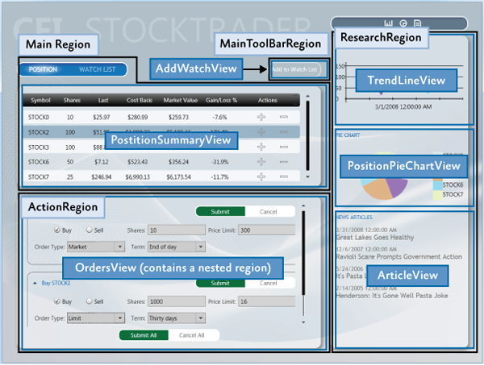

## UI Layout Concepts

The root object in a composite application is known as the _shell_. The shell acts as a master page for the application. The shell contains one or more regions. Regions are place holders for content that will be loaded at run time. Regions are attached to UI elements such as a **ContentControl**, **ItemsControl**, **TabControl** or a custom control and manage the UI element's content. Region content can be loaded automatically or on-demand, depending on the application requirements.

Typically, a region's content is a view. A view encapsulates a portion of your UI that you would like to keep as decoupled as possible from other parts of the application. You can define a view as a user control, data template, or even a custom control.

A region manages the display and layout of views. Regions can be accessed in a decoupled way by their name and support dynamically adding or removing views. A region is attached to a hosting control. Think of regions as containers into which views are dynamically loaded.

The following sections introduce the high-level core concepts for composite application development.

### Shell

The shell is the application root object that contains the primary UI content. In a Windows Presentation Foundation (WPF) application, the shell is the **Window** object.

The shell plays the role of a master page providing the layout structure for the application. The shell contains one or more named regions where modules can specify the views that will appear. It can also define certain top-level UI elements, such as the background, main menu, and toolbar.

The shell defines the overall appearance of the application. It might define styles and borders that are present and visible in the shell layout itself, and it might also define styles, templates, and themes that will be applied to the views that are plugged into the shell.

Typically, the shell is a part of the WPF application project. The assembly that contains the shell might or might not reference the assemblies that contain the views to be loaded in the shell's regions.

### Views

Views are the main unit of UI construction within a composite application. You can define a view as a user control, page, data template, or custom control. A view encapsulates a portion of your UI that you would like to keep as decoupled as possible from other parts of the application. You can choose what goes in a view based on encapsulation or a piece of functionality, or you can choose to define something as a view because you will have multiple instances of that view in your application.

Because of the content model of WPF, there is nothing specific to the Prism Library required to define a view. The easiest way to define a view is to define a user control. To add a view to the UI, you simply need a way to construct it and add it to a container. WPF provides mechanisms to do this. The Prism Library adds the ability to define a region into which a view can be dynamically added at run time.

#### Composite Views

A view that supports specific functionality can become complicated. In that case, you might want to divide the view into several child views and have the parent view handle constructing itself by using the child views as parts. The application might do this statically at design time, or it might support having modules add child views through a contained region at run time. When you have a view that is not fully defined in a single view class, you can refer to that as a composite view. In many situations, a composite view is responsible for constructing the child views and for coordinating the interactions between them. You can design child views that are more loosely coupled from their sibling views and their parent composite view by using the Prism Library commands and the event aggregator.

#### Views and Design Patterns

Although the Prism Library does not require that you use them, you should consider using one of several UI design patterns when implementing a view. The Stock Trader RI and QuickStarts demonstrate the Model-View-ViewModel (MVVM) pattern as a way to implement a clean separation between the view layout and the view logic.

The MVVM UI design pattern is recommended because it is a natural fit for the Microsoft XAML platforms. The dependency property system and rich data binding stack of these platforms enable the view and view model to communicate in a loosely coupled manner.

Separating the logic from the view is important for testability and maintainability, and it improves the developer-designer workflow.

If you create a view with a user control or custom control and put all the logic in the code-behind file, your view can be difficult to test because you have to create an instance of the view to unit test the logic. This is a problem particularly if the view derives from, or depends on, running WPF components as part of its execution context. To make sure that you can unit test the view logic in isolation without these dependencies, you need to be able to create a mockup of the view to remove the dependencies on the execution context, which requires separate classes for the view and the logic.

If you define a view as a data template, there is no code associated with the view itself. Therefore, you have to put the associated logic somewhere else. The same clean separation of logic from layout that is required for testability also helps make the view easier to maintain.

_**Note:** Unit testing and UI automation testing are two different types of testing with different coverage._

_Unit testing best practices recommend that the object be tested in isolation. To achieve object isolation, you need a mockup or stub for each external dependency. Then granular unit tests are run against the object._

_UI automation testing runs the application, applies gestures to the UI, and then tests for the expected results. This type of test verifies that UI elements are correctly connected to the application logic._

Separating the logic from the view provides a clean separation of concerns. In addition to testability considerations, this separation enables designers to work on the UI independently of the developer. For more information about MVVM, see [Implementing the MVVM Pattern](40-ImplementingtheMVVMPattern.md).

#### Commands, UI Triggers, Actions, and Behaviors

When a view is implemented with its logic in the code-behind file, you add event handlers to service UI interactions. However, when you use MVVM, the view model cannot directly handle events raised by the UI. To route UI gesture events to the view model, you can use commands or UI triggers, actions, and behaviors.

##### Commands

Commands separate the semantics and the object that invokes a command from the logic that executes the command. Built into commands is the ability to indicate whether an action is available. Commands in the UI are data bound to **ICommand** properties on the view model. For more information about commands, see [Commands](40-ImplementingtheMVVMPattern.md#commands) in [Implementing the MVVM Pattern](40-ImplementingtheMVVMPattern.md).

##### UI Triggers, Actions, and Behaviors

Triggers, actions, and behaviors are part of the **Microsoft.Expression.Interactivity** namespace and are shipped with Blend for Visual Studio 2013. They are also part of the Blend SDK. Triggers, actions, and behaviors provide a comprehensive API for handling UI events or commands, and then routing them to the **ICommand** properties methods exposed by the **DataContext**. For more information about UI triggers, actions, and behaviors, see sections [Implementing the MVVM Pattern](40-ImplementingtheMVVMPattern.md) and [Interaction Triggers and Events to Commands](45-AdvancedMVVMScenarios.md#interaction-triggers-and-commands) in [Advanced MVVM Scenarios](45-AdvancedMVVMScenarios.md).

##### User Interactions

User interactions are interactions that the application presents to the user. These interaction are typically popup windows presented to the user. In MVVM scenarios these user interactions can be generated either from the view or from the view model. Prism provides **InteractionRequests** and **InteractionRequestTriggers** for cases when the view model needs to request a user interaction, and the **InvokeCommandAction** action for when the view needs to invoke a command when a specified event is fired.

For more information about user Interactions, examples, and how to use them, see the [Interactivity QuickStart](https://msdn.microsoft.com/en-us/library/ff921081%28v=pandp.40%29.aspx) .

#### Data Binding

Data binding is one of the most important framework features of the XAML platforms. To successfully develop applications on the XAML platforms, you need a solid understanding of data binding.

Data binding takes full advantage of the intrinsic change notification provided by the dependency property system. When combined with the Common Language Runtime (CLR) class implementation of the **INotifyPropertyChanged** interface, change notification enables codeless interaction between the target and source objects participating in the data binding.

Data binding enables dissimilar target and source types to data bind by using a value converter to convert one type to the other type. Data binding has multiple validation hooks within its pipeline that you can use to validate user input.

You are strongly encouraged to read the [Dependency Properties Overview](http://msdn.microsoft.com/en-us/library/ms752914.aspx) and [Data Binding Overview](http://msdn.microsoft.com/en-us/library/ms752347.aspx) topics on MSDN. A full understand of these two topics is critical to successfully developing applications on the Microsoft XAML platforms. For more information about data binding, see [Data Binding](40-ImplementingtheMVVMPattern.md#data-binding) in [Implementing the MVVM Pattern](40-ImplementingtheMVVMPattern.md).

### Regions

Regions are enabled in the Prism Library through a region manager, regions, and region adapters. The next sections describe how they work together.

#### Region Manager

The **RegionManager** class is responsible for creating and maintaining a collection of regions for the host controls. The **RegionManager** uses a control-specific adapter that associates a new region with the host control. The following illustration shows the relationship between the region, control, and adapter set up by the **RegionManager**.

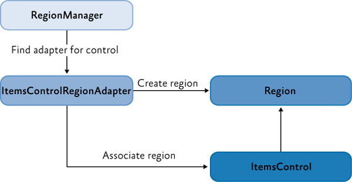

The **RegionManager** can create regions in code or in XAML. The **RegionManager.RegionName** attached property is used to create a region in XAML by applying the attached property to the host control.

Applications can contain one or more instances of a **RegionManager**. You can specify the **RegionManager** instance into which you want to register the region. This is useful if you want to move the control around in the visual tree and do not want the region to be cleared when the attached property value is removed.

The **RegionManager** provides a RegionContext attached property that permits its regions to share data.


#### Region Implementation

A region is a class that implements the **IRegion** interface. The term _region_ represents a container that can hold dynamic data that is presented in a UI. A region allows the Prism Library to place dynamic content contained in modules in predefined placeholders in a UI container.

Regions can hold any type of UI content. A module can contain UI content presented as a user control, a data type that is associated with a data template, a custom control, or any combination of these. This lets you define the appearance for the UI areas and then have modules place content in these predetermined areas.

A region can contain zero or more items. Depending on the type of host control the region is managing, one or more of the items could be visible. For example, a **ContentControl** can display only a single object. However, the region in which it is located can contain many items, and an **ItemsControl** can display multiple items. This allows each item in the region to be visible in the UI.

In the following illustration, the Stock Trader RI shell contains four regions: **MainRegion**, **MainToolbarRegion**, **ResearchRegion**, and **ActionRegion**. These regions are populated by the various modules in the application—the content can be changed at any time.


##### Module User Control to Region Mapping

To demonstrate how modules and content are associated with regions, see the following illustration. It shows the association of **WatchModule** and the **NewsModule** with the corresponding regions in the shell.

The **MainRegion** contains the **WatchListView** user control, which is contained in the **WatchModule**. The **ResearchRegion** also contains the **ArticleView** user control, which is contained in the **NewsModule**.

In applications created with the Prism Library, mappings like this will be a part of the design process because designers and developers use them to determine what content is proposed to be in a specific region. This allows designers to determine the overall space needed and any additional items that must be added to ensure that the content will be viewable in the allowable space.


#### Default Region Functionality

While you do not need to fully understand region implementations to use them, it might be useful to understand how controls and regions are associated and the default region functionality: for example, how a region locates and instantiates views, how views can be notified when they are the active view, or how view lifetime can be tied to activation.

The following sections describe the region adapter and region behaviors.

##### Region Adapter

To expose a UI control as a region, it must have a region adapter. Region adapters are responsible for creating a region and associating it with the control. This allows you to use the **IRegion** interface to manage the UI control contents in a consistent way. Each region adapter adapts a specific type of UI control. The Prism Library provides the following three region adapters:

- **ContentControlRegionAdapter**. This adapter adapts controls of type **System.Windows.Controls.ContentControl** and derived classes.
- **SelectorRegionAdapter**. This adapter adapts controls derived from the class **System.Windows.Controls.Primitives.Selector**, such as the **System.Windows.Controls.TabControl** control.
- **ItemsControlRegionAdapter**. This adapter adapts controls of type **System.Windows.Controls.ItemsControl** and derived classes.

##### Region Behaviors

The Prism Library introduces the concept of region behaviors. These are pluggable components that give a region most of its functionality. Region behaviors were introduced to support view discovery and region context (described later in this topic), and to create an API that is consistent across both WPF and Silverlight. Additionally, behaviors provide an effective way to extend a region's implementation.

A region behavior is a class that is attached to a region to give the region additional functionality. This behavior is attached to the region and remains active for the lifetime of the region. For example, when an **AutoPopulateRegionBehavior** is attached to a region, it automatically instantiates and adds any **ViewTypes** that are registered against regions with that name. For the lifetime of the region, it keeps monitoring the **RegionViewRegistry** for new registrations. It is easy to add custom region behaviors or replace existing behaviors, either on a system-wide or a per-region basis.

The next sections describe the default behaviors that are automatically added to all regions. One behavior, the **SelectorItemsSourceSyncBehavior**, is only attached to controls that derive from the **Selector**.

##### Registration Behavior

The **RegionManagerRegistrationBehavior** is responsible for making sure that the region is registered to the correct **RegionManager**. When a view or control is added to the visual tree as a child of another control or region, any region defined in the control should be registered in the **RegionManager** of the parent control. When the child control is removed, the registered region is unregistered.

##### Auto-Population Behavior

There are two classes responsible for implementing view discovery. One of them is the **AutoPopulateRegionBehavior**. When it is attached to a region, it retrieves all view types that are registered under the name of the region. It then creates instances of those views and adds them to the region. After the region is created, the **AutoPopulateRegionBehavior** monitors the **RegionViewRegistry** for any newly registered view types for that region name.

If you want to have more control over the view discovery process, consider creating your own implementation of the **IRegionViewRegistry** and the **AutoPopulateRegionBehavior**.

##### Region Context Behaviors

The region context functionality is contained within two behaviors: the **SyncRegionContextWithHostBehavior** and the **BindRegionContextToDependencyObjectBehavior**. These behaviors are responsible for monitoring changes to the context that were made on the region, and then synchronizing the context with a context dependency property attached to the view.

##### Activation Behavior

The **RegionActiveAwareBehavior** is responsible for notifying a view if it is active or inactive. The view must implement **IActiveAware** to receive these change notifications. This active aware notification is one-directional (it travels from the behavior to the view). The view cannot affect its active state by changing the active property on the **IActiveAware** interface.

##### Region Lifetime Behavior

The **RegionMemberLifetimeBehavior** is responsible for determining if an item should be removed from the region when it is deactivated. The **RegionMemberLifetimeBehavior** monitors the region's **ActiveViews** collection to discover items that transition into a deactivated state. The behavior checks the removed items for **IRegionMemberLifetime** or the **RegionMemberLifetimeAttribute** (in that order) to determine if it should be kept alive on removal.

If the item in the collection is a **System.Windows.FrameworkElement**, it will also check its **DataContext** for **IRegionMemberLifetime** or the **RegionMemberLifetimeAttribute**.

The region items are checked in the following order:

1. **IRegionMemberLifetime.KeepAlive** value

2. **DataContext's IRegionMemberLifetime.KeepAlive** value

3. **RegionMemberLifetimeAttribute.KeepAlive** value

4. **DataContext's RegionMemberLifetimeAttribute.KeepAlive** value

##### Control-Specific Behaviors

The **SelectorItemsSourceSyncBehavior** is used only for controls that derive from **Selector**, such as a tab control in WPF. It is responsible for synchronizing the views in the region with the items of the selector, and then synchronizing the active views in the region with the selected items of the selector.

#### Extending the Region Implementation

The Prism Library provides extension points that allow you to customize or extend the default behavior of the provided APIs. For example, you can write your own region adapters, region behaviors, or change the way the Navigation API parses URIs. For more information about extending the Prism Library, see [Extending the Prism Library](AppendixE1-ExtendingPrism.md).

### View Composition 

View composition is the constructing of a view. In composite applications, views from multiple modules have to be displayed at run time in specific locations within the application UI. To achieve this, you need to define the locations where the views will appear and how the views will be created and displayed in those locations.

Views can be created and displayed in the locations either automatically through view discovery, or programmatically through view injection. These two techniques determine how individual views are mapped to named locations within the application UI.

#### View Discovery

In view discovery, you set up a relationship in the **RegionViewRegistry** between a region's name and the type of a view. When a region is created, the region looks for all the **ViewTypes** associated with the region and automatically instantiates and loads the corresponding views. Therefore, with view discovery, you do not have explicit control over when the views that correspond to a region are loaded and displayed.

#### View Injection

In view injection, your code obtains a reference to a region, and then programmatically adds a view into it. Typically, this is done when a module initializes or as a result of a user action. Your code will query a **RegionManager** for a specific region by name and then inject views into it. With view injection, you have more control over when views are loaded and displayed. You also have the ability to remove views from the region. However, with view injection, you cannot add a view to a region that has not yet been created.

#### Navigation

The Prism Library 4.0 contains Navigation APIs. The Navigation APIs simplify the view injection process by allowing you to navigate a region to an URI. The Navigation API instantiates the view, adds it to the region, and then activates it. Additionally, the Navigation API allows navigating back to a previously created view contained in a region. For more information about the Navigation APIs, see [Navigation](60-Navigation.md).

#### When to Use View Discovery vs. View Injection

Choosing which view loading strategy to use for a region depends on the application requirements and the function of the region.

Use view discovery in the following situations:

- Automatic view loading is desired or required.
- Single instances of a view will be loaded into the region.

Use view injection in the following situations:

- Your application uses the Navigation APIs.
- You need explicit or programmatic control over when a view is created and displayed, or you need to remove a view from a region; for example, as a result of application logic or navigation.
- You need to display multiple instances of the same views in a region, where each view instance is bound to different data.
- You need to control which instance of a region a view is added to. For example, you want to add a customer detail view to a specific customer detail region. (This scenario requires implementing scoped regions as described later in this topic.)

## UI Layout Scenarios

In composite applications, views from multiple modules are displayed at run time in specific locations within the application UI. To achieve this, you need to define the locations where the views will appear and how the views will be created and displayed in those locations.

The decoupling of the view and the location in the UI in which it will be displayed allows the appearance and layout of the application to evolve independently of the views that appear within the region.

The next sections describe the core scenarios you will encounter when you develop a composite application. When appropriate, examples from the Stock Trader RI will be used to demonstrate a solution for the scenario.

### Implementing the Shell

The shell is the application root object in which the primary UI content is contained. In a Windows Presentation Foundation (WPF) application, the shell is the **Window** object.

A shell can contain named regions where modules can specify the views that will appear. It can also define certain top-level UI elements, such as the main menu and toolbar. The shell defines the overall structure and appearance for the application, and is similar to an ASP.NET master page control. It could define styles and borders that are present and visible in the shell layout itself, and it could also define styles, templates, and themes that are applied to the views that are plugged into the shell.

You do not need to have a distinct shell as part of your application architecture to use the Prism Library. If you are building a completely new composite application, implementing a shell provides a well-defined root and initialization pattern for setting up the main UI of your application. However, if you are adding Prism Library features to an existing application, you do not have to change the basic architecture of your application to add a shell. Instead, you can alter your existing window definitions or controls to add regions that can pull in views as needed.

You can also have more than one shell in your application. If your application is designed to open more than one top-level window for the user, each top-level window acts as shell for the content it contains.

#### Stock Trader RI Shell

The WPF Stock Trader RI has a shell as its main window. In the following illustration, the shell and views are highlighted. The shell is the main window that appears when the Stock Trader RI starts and which contains all the views. It defines the regions into which modules add their views and a couple of top-level UI items, including the CFI Stock Trader title and the Watch List tear-off banner.


The shell implementation in the Stock Trader RI is provided by Shell.xaml, its code-behind file Shell.xaml.cs, and its view model ShellViewModel.cs. Shell.xaml includes the layout and UI elements that are part of the shell, including definitions of regions to which modules add their views.

The following XAML shows the structure and main XAML elements that define the shell. Notice that the **RegionName** attached property is used to define the four regions and that the window background image provides a background for the shell.

```
<!--Shell.xaml (WPF) -->
<Window x:Class="StockTraderRI.Shell">

    <!--shell background -->
    <Window.Background>
        <ImageBrush ImageSource="Resources/background.png" Stretch="UniformToFill"/>
    </Window.Background>

    <Grid>

        <!-- logo -->
        <Canvas x:Name="Logo" ...>
            <TextBlock Text="CFI" ... />
            <TextBlock Text="STOCKTRADER" .../>
        </Canvas>

        <!-- main bar -->
        <ItemsControl 
            x:Name="MainToolbar"
            prism:RegionManager.RegionName="{x:Static inf:RegionNames.MainToolBarRegion}"/>

        <!-- content -->
        <Grid>
            <Controls:AnimatedTabControl
                x:Name="PositionBuySellTab"
                prism:RegionManager.RegionName="{x:Static inf:RegionNames.MainRegion}"/>
        </Grid>

        <!-- details -->
        <Grid>
            <ContentControl
                x:Name="ActionContent"
                prism:RegionManager.RegionName="{x:Static inf:RegionNames.ActionRegion}"/>
        </Grid>

        <!-- sidebar -->
        <Grid x:Name="SideGrid">
            <Controls:ResearchControl
                prism:RegionManager.RegionName="{x:Static inf:RegionNames.ResearchRegion}" />
        </Grid>

    </Grid>
</Window>
```

The implementation of the **Shell** code-behind file is very simple. The **Shell** is exported so that when the bootstrapper creates it, its dependencies will be resolved by the Managed Extensibility Framework (MEF). The shell has its single dependency—the **ShellViewModel**—injected during construction, as shown in the following example.

```
// Shell.xaml.cs
[Export]
public partial class Shell : Window
{
    public Shell()
    {
        InitializeComponent();
    }

    [Import]
    ShellViewModel ViewModel
    {
        set
        {
            this.DataContext = value;
        }
    }
}
```

```
// ShellViewModel.cs
[Export]
public class ShellViewModel : BindableBase
{
    // This is where any view model logic for the shell would go.
}
```

The minimal code in the code-behind file illustrates the power and simplicity of the composite application architecture and loose coupling between the shell and its constituent views.

### Defining Regions

You define where views will appear by defining a layout with named locations, known as regions. Regions act as placeholders for one or more views that will be displayed at run time. Modules can locate and add content to regions in the layout without knowing how and where the region is displayed. This allows the layout to change without affecting the modules that add the content to the layout.

Regions are defined by assigning a region name to a WPF control, either in XAML as shown in the previous Shell.xaml file or in code. Regions can be accessed by their region name. At run time, views are added to the named Region control, which then displays the view or views according to the layout strategy that the views implement. For example, a tab control region will lay out its child views in a tabbed arrangement. Regions support the addition or removal of views. Views can be created and displayed in regions either programmatically or automatically. In the Prism Library, the former is achieved through view injection and the latter through view discovery. These two techniques determine how individual views are mapped to the named regions within the application UI.

The shell of the application defines the application layout at the highest level; for example, by specifying the locations for the main content and the navigation content, as shown in the following illustration. Layout within these high-level views is similarly defined, allowing the overall UI to be recursively composed.


Regions are sometimes used to define locations for multiple views that are logically related. In this scenario, the region control is typically an **ItemsControl**-derived control that will display the views according to the layout strategy that it implements, such as in a stacked or tabbed layout arrangement.

Regions can also be used to define a location for a single view; for example, by using a **ContentControl**. In this scenario, the region control displays only one view at a time, even if more than one view is mapped to that region location.

#### Stock Trader RI Shell Regions


A multiple-view layout is also demonstrated in the Stock Trader RI when the application is buying or selling a stock. The Buy/Sell area is a list-style region that shows multiple buy/sell views (**OrderCompositeView**) as part of its list, as shown in the following illustration.

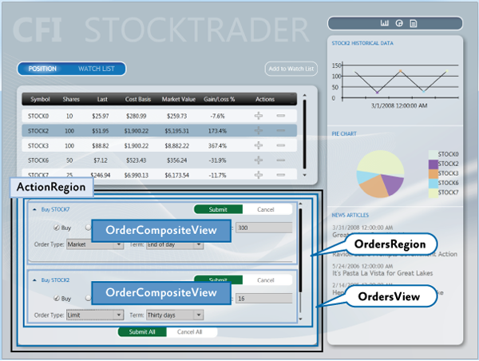

The shell's **ActionRegion** contains the **OrdersView**. The **OrdersView** contains the **Submit All** and **Cancel All** buttons as well as the **OrdersRegion**. The **OrdersRegion** is attached to a **ListBox** control which displays multiple **OrderCompositeViews**.

#### IRegion

A region is a class that implements the **IRegion** interface. The region is the container that holds content to be displayed by a control. The following code shows the **IRegion** interface.

```
public interface IRegion : INavigateAsync, INotifyPropertyChanged
{
    IViewsCollection Views { get; }
    IViewsCollection ActiveViews { get; }
    object Context { get; set; }
    string Name { get; set; }
    Comparison<object> SortComparison { get; set; }
    IRegionManager Add(object view);
    IRegionManager Add(object view, string viewName);
    IRegionManager Add(object view, string viewName, bool createRegionManagerScope);
    void Remove(object view);
    void Deactivate(object view);
    object GetView(string viewName);
    IRegionManager RegionManager { get; set; }
    IRegionBehaviorCollection Behaviors { get; }
    IRegionNavigationService NavigationService { get; set; }
}
```

#### Adding a Region in XAML

The **RegionManager** supplies an attached property that you can use for simple region creation in XAML. To use the attached property, you must load the Prism Library namespace into the XAML and then use the **RegionName** attached property. The following example shows how to use the attached property in a window with an **AnimatedTabControl**.

Notice the use of the **x:Static** markup extension to reference the **MainRegion** string constant. This practice eliminates magic strings in the XAML.

```
<!-- (WPF) -->
<Controls:AnimatedTabControl 
    x:Name="PositionBuySellTab"
    prism:RegionManager.RegionName="{x:Static inf:RegionNames.MainRegion}"/>
```
#### Adding a Region by Using Code

The **RegionManager** can register regions directly without using XAML. The following code example shows how to add a region to a control from the code-behind file. First a reference to the region manager is obtained. Then, using the **RegionManager** static methods **SetRegionManager** and **SetRegionName**, the region is attached to the UI's **ActionContent** control and then that region is named **ActionRegion**.

```
IRegionManager regionManager = ServiceLocator.Current.GetInstance<IRegionManager>();
RegionManager.SetRegionManager(this.ActionContent, regionManager);
RegionManager.SetRegionName(this.ActionContent, "ActionRegion");
```

### Displaying Views in a Region When the Region Loads

With the view discovery approach, modules can register views (view models or presentation models) for a specific named location. When that location is displayed at run time, any views that have been registered for that location will be created and displayed within it automatically.

Modules register views with a registry. The parent view queries this registry to discover the views that were registered for a named location. After they are discovered, the parent view places those views on the screen by adding them to the placeholder control.

After the application is loaded, the composite view is notified to handle the placement of new views that have been added to the registry.

The following illustration shows the view discovery approach.


The Prism Library defines a standard registry, **RegionViewRegistry**, to register views for these named locations.

To show a view in a region, register the view with the region manager, as shown in the following code example. You can directly register a view type with the region, in which case the view will be constructed by the dependency injection container and added to the region when the control hosting the region is loaded.

```
// View discovery
this.regionManager.RegisterViewWithRegion("MainRegion", typeof(EmployeeView));
```

Optionally, you can provide a delegate that returns the view to be shown, as shown in the next example. The region manager will display the view when the region is created. 

```
// View discovery
this.regionManager.RegisterViewWithRegion("MainRegion", () => this.container.Resolve<EmployeeView>());
```

The UI Composition QuickStart has a walkthrough in the EmployeeModule ModuleInit.cs file that demonstrates how to use the **RegisterViewWithRegion** method.

### Displaying Views in a Region Programmatically

In the view injection approach, views are programmatically added or removed from a named location by the modules that manage them. To enable this, the application contains a registry of named locations in the UI. A module can use the registry to look up one of the locations and then programmatically inject views into it. To make sure that locations in the registry can be accessed similarly, each of the named locations adheres to a common interface used to inject the view. The following illustration shows the view injection approach.

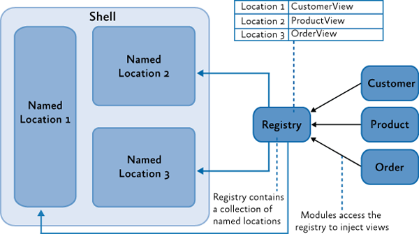

The Prism Library defines a standard registry, **RegionManager**, and a standard interface, **IRegion**, for access these locations.

To use view injection to add a view to a region, get the region from the region manager, and then call the **Add** method, as shown in the following code. With view injection, the view is displayed only after the view is added to a region, which can happen when the module is loaded or when a user action completes a predefined action.

```
// View injection
IRegion region = regionManager.Regions["MainRegion"];

var ordersView = container.Resolve<OrdersView>();
region.Add(ordersView, "OrdersView");
region.Activate(ordersView);
```

In addition to the Stock Trader RI, the UI Composition QuickStart has a walkthrough for implementing view injection. 

#### Navigation

The Prism Library 5.0 includes Navigation APIs that provide a rich and consistent API for implementing navigation in a WPF application.

Region navigation is a form of view injection. When a navigation request is processed, it will attempt to locate a view in the region that can fulfill the request. If it cannot find a matching view, it calls the application container to create the object, and then injects the object into the target region and activates it.

The following code example from the Stock Trader RI **ArticleViewModel** illustrates how to initiate a navigation request.

```
this.regionManager.RequestNavigate(RegionNames.SecondaryRegion, new Uri("/NewsReaderView", UriKind.Relative));
```

For more information about region navigation, see [Navigation](60-Navigation.md). The View-Switching Navigation QuickStart and State-Based Navigation QuickStart are also examples of implementing application navigation.

#### Ordering Views in a Region

Whether it uses view discovery or view Injection, an application might need to order how views appear in a **TabControl**, **ItemsControl**, or any other control that displays multiple active views. By default, views appear in the order that they were registered and added into the region.

When a composite application is built, views are often registered from different modules. Declaring dependencies between modules can help alleviate the problem, but when modules and views do not have any real interdependencies, declaring an artificial dependency couples modules unnecessarily.

To allow views to participate in ordering themselves, the Prism Library provides the **ViewSortHint** attribute. This attribute contains a string **Hint** property that allows a view to declare a hint of how it should be ordered in the region.

When displaying views, the **Region** class uses a default view sorting routine that uses the hint to order the views. This is a simple case-sensitive ordinal sort. Views that have the sort hint attribute are ordered ahead of those without. Also, those without the attribute appear in the order they were added to the region.

If you want to change how views are ordered, the **Region** class provides a **SortComparison** property that you can set with your own **Comparison&lt;_object_&gt;** delegate method. It is important to note that the ordering of the region's **Views** and **ActiveViews** properties are reflected in the UI because adapters such as the **ItemsControlRegionAdapter** bind directly to these properties. A custom region adapter could implement its own sorting and filter that will override how the region orders views.

The View Switching QuickStart demonstrates a simple numbering scheme to order the views in the left-hand-side navigation region. The following code examples show **ViewSortHint** applied to each of the navigation item views.

```
[Export]
[ViewSortHint("01")]
public partial class EmailNavigationItemView

[Export]
[ViewSortHint("02")]
public partial class CalendarNavigationItemView

[Export]
[ViewSortHint("03")]
public partial class ContactsDetailNavigationItemView

[Export]
[ViewSortHint("04")]
public partial class ContactsAvatarNavigationItemView
```

### Sharing Data Between Multiple Regions

The Prism Library provides multiple approaches to communicating between views, depending on your scenario. The region manager provides the **RegionContext** property as one of these approaches.

**RegionContext** is useful when you want to share context between a parent view and child views that are hosted in a region. **RegionContext** is an attached property. You set the value of the context on the region control so that it can be made available to all child views that are displayed in that region control. The region context can be any simple or complex object and can be a data-bound value. The **RegionContext** can be used with either view discovery or view injection.

_**Note:** The **DataContext** property in WPF is used to set the local data context for the view. It allows the view to use data binding to communicate with a view model, local presenter, or model. **RegionContext** is used to share context between multiple views and is not local to a single view. It provides a simple mechanism for sharing context between multiple views._

The following code shows how the **RegionContext** attached property is used in XAML.

```
<TabControl AutomationProperties.AutomationId="DetailsTabControl" 
    prism:RegionManager.RegionName="{x:Static local:RegionNames.TabRegion}"
    prism:RegionManager.RegionContext="{Binding Path=SelectedEmployee.EmployeeId}"
...>
```

You can also set the **RegionContext** in code, as shown in the following example.

```
RegionManager.Regions["Region1"].Context = employeeId;
```

To retrieve the **RegionContext** in a view, the **GetObservableContext** static method of the **RegionContext** class is used. It passes the view as a parameter and then accesses its **Value** property, as shown in the following code example.

```
private void GetRegionContext()
{
    this.Model.EmployeeId = (int)RegionContext.GetObservableContext(this).Value;
}
```

The value of the **RegionContext** can be changed from within a view by simply assigning a new value to its **Value** property. Views can opt to be notified of changes to the **RegionContext** by subscribing to the **PropertyChanged** event on the **ObservableObject** that is returned by the **GetObservableContext** method. This allows multiple views to be kept in synchronization when their **RegionContext** is changed. The following code example demonstrates subscribing to the **PropertyChanged** event.

```
ObservableObject<object> viewRegionContext = 
                RegionContext.GetObservableContext(this);
viewRegionContext.PropertyChanged += this.ViewRegionContext_OnPropertyChangedEvent;

private void ViewRegionContext_OnPropertyChangedEvent(object sender, 
                    PropertyChangedEventArgs args)

{
    if (args.PropertyName == "Value")
    {
        var context = (ObservableObject<object>) sender;
        int newValue = (int)context.Value;
    }
}
```

_**Note:** The **RegionContext** is set as an attached property on the content object hosted in the region. This means that the content object has to derive from **DependencyObject**. In the preceding example, the view is a visual control, which ultimately derives from **DependencyObject**._

_If you choose to use WPF data templates to define your view, the content object will represent the **ViewModel** or **PresentationModel**. If your view model or presentation model needs to retrieve the **RegionContext**, it will need to derive from the **DependencyObject** base class._

### Creating Multiple Instances of a Region

Scoped regions are available only with view injection. You should use them if you need a view to have its own instance of a region. Views that define regions with attached properties automatically inherit their parent's **RegionManager**. Usually, this is the global **RegionManager** that is registered in the shell window. If the application creates more than one instance of that view, each instance would attempt to register its region with the parent **RegionManager**. **RegionManager** allows only uniquely named regions; therefore, the second registration would produce an error.

Instead, use scoped regions so that each view will have its own **RegionManager** and its regions will be registered with that **RegionManager** rather than the parent **RegionManager**, as shown in the following illustration.

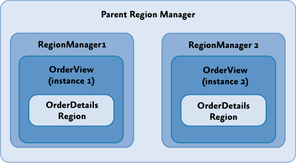

To create a local **RegionManager** for a view, specify that a new **RegionManager** should be created when you add your view to a region, as illustrated in the following code example.

```
IRegion detailsRegion = this.regionManager.Regions["DetailsRegion"];
View view = new View();
bool createRegionManagerScope = true;
IRegionManager detailsRegionManager = detailsRegion.Add(view, null, createRegionManagerScope);
```

The **Add** method will return the new **RegionManager** that the view can retain for further access to the local scope.

### Creating Views

The visual representation of your application can take many forms, including user controls, custom controls, and data templates, to name a few. In the case of the Stock Trader RI, user controls are typically used to represent distinct sections on the main window, but this is not a standard. In your application, you should use an approach that you are most familiar with and that fits into how you work as a designer. Regardless of the predominating visual representation in your application, you will inevitably use a combination of user controls, custom controls, and data templates in your overall design. The following figure shows where the Stock Trader RI uses these various items. This illustration also serves as a reference for the following sections, which describe each of the items.

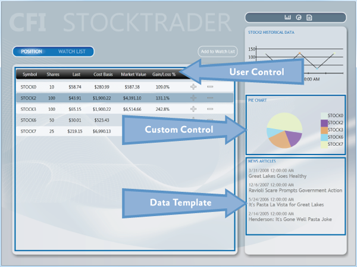

#### User Controls

Both Blend for Visual Studio 2013 and Visual Studio 2013 provide rich support for creating user controls. User controls created with these tools are therefore recommended for creating UI content with the Prism Library. As mentioned earlier in this topic, the Stock Trader RI uses them extensively to create content that will be inserted into regions. The **WatchListView.xaml** user control is a good example of a simple UI representation that is contained inside the **WatchModule**. This control is a very simple control that is straightforward to create using this model.

#### Custom Controls

In some situations, a user control is too limiting. In these cases, custom layout or extensibility is more important than ease of creation. This is where custom controls are useful. In the Stock Trader RI, the pie chart control is a good example of this. This control is composed from data derived from the positions and shows a chart of the overall portfolio. This type of control is a little more challenging than a user control to create, and it has limited visual design support in Blend for Visual Studio 2013 and Visual Studio 2013, compared to a user control.

#### Data Templates

Data templates are an important part of most types of data-driven applications. The use of data templates for list-based controls is prevalent throughout the Stock Trader RI. In many cases, you can use a data template to create complete visual representations without needing to create any type of control. The **ResearchRegion** uses a data template to show articles and, in conjunction with an **Items** style, provides an indication of which item was selected.

Blend for Visual Studio 2013 and Visual Studio 2013 have full visual design support for data templates.

#### Resources

Resources such as styles, resource dictionaries, and control templates can be scattered throughout an application. This is especially true with a composite application. When you consider where to place resources, pay special attention to dependencies between UI elements and the resources they need. The Stock Trader RI solution, shown in the following figure, contains labels that indicate the various areas where resources can live.

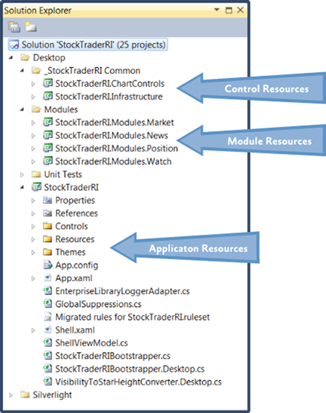

##### Application Resources

Typically, application resources are resources that are available to an application as a whole. These resources tend to be focused on the root application, but they can also provide default styling on a type basis for modules or controls. An example of this is a text box style that is applied to the text box type in the root application. This style will be available to all text boxes in the application unless the style is overridden at the module or control level.

##### Module Resources

Module resources play the same role as root application resources in that they can apply to all items in a module. Using resources at this level can provide a consistent appearance across the entire module and can also allow for reuse in more specific instances that span one or more visual components. The use of resources at the module level should be contained within the individual module. Creating dependencies between modules can lead to issues that are difficult to locate when UI elements appear incorrectly.

##### Control Resources

Control resources are usually contained in control libraries and can be used by all the controls in the control library. These resources tend to have the most limited scope because control libraries typically contain very specific controls and do not contain user controls. (In an application created with the Prism Library, user controls are typically placed in the modules in which they are used.)

## UI Design Guidance

The goal of this topic is to provide some high-level guidance to the XAML designer and developer who are building an application with the Prism Library and WPF. This topic describes UI layout, visual representation, data binding, resources, and the presentation model. After reading this topic, you should have a high-level understanding of how to approach designing the UI of an application based on the Prism Library and some of the techniques that can help you create a maintainable UI in composite applications.

### Guidelines for Designing User Interfaces

The layout of composite applications created with the Prism Library builds on the standard principals of WPF —the layout uses the concepts of panels that contain related items. However, with composite applications, the content inside the various panels is dynamic and is not known during design time. This forces designers and developers to create page structures that can contain layout content and then design each of the elements that fit into the layout separately. As a designer or developer, this means that you have to think about two main layout concepts in the Prism Library: container composition and regions.

#### Container Composition

Container composition is really just an extension of the containment model that WPF inherently provides. The term _container_ can mean any element, including a window, page, user control, panel, custom control, control template, or data template, that can contain other elements.

How you visualize your UI can vary from implementation to implementation, but you will find recurring themes that stand out. You will create a window, page, or user control that contains both fixed content and dynamic content. The fixed content will consist of the overall structure of the containing UI element, and the dynamic content will be what is placed inside a region.

For example, the WPF Stock Trader RI has a startup window named Shell.xaml that contains the overall structure for the application. The next illustration shows the shell loaded in Blend for Visual Studio 2013. Notice that only the fixed portion of the UI is visible. The remaining sections of the shell are dynamically inserted into the various regions by the modules as the application loads.

The design-time experience is a little limited in this type of application, but the fact that you know content will be placed in the various regions at run time is something that you need to design for. To see an example of this, compare the designer view of the main page in the next illustration to the run-time view in the illustration that follows it. In the designer view, the page is mostly empty. Contrast that with the run-time view, where there is a position area that contains a tab control with position data, and a trend line, pie chart, and news area pertaining to the selected stocks. The differences between the designer view and run-time view demonstrate the challenges designers and developers face when they create applications built with the Prism Library.

The items cannot be seen during design time; therefore, determining how big they are and how they fit into the overall appearance of the application is a little difficult. Consider the following as you create the layout for your containers:

- Are there any size constraints that will limit how large content can be? If there are, consider using containers that support scrolling.
- Consider using an expander and **ScrollViewer** combination for situations in which a large amount of dynamic content needs to fit into a confined area.
- Pay close attention to how content enlarges as the screen content grows to ensure that the appearance of your application is appealing in any resolution.


Stock Trader RI main window in Blend for Visual Studio 2013

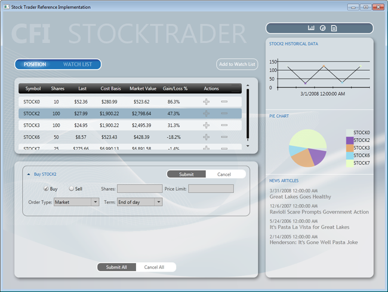

Stock Trader RI main window during run time

#### Viewing Composite Application at Design Time

The two previous figures illustrate one of the challenges of working with high-level views that are composed at run time. Each UI element in a composite application must be designed separately. This makes it hard to visualize how the composite page or window will look at run time. To visualize the composite view in its composed state, you can create a test project with a page or window that contains all the UI elements for the view you want to test. 

Additionally, consider using the design-time sample data features in Blend for Visual Studio 2013 and Visual Studio 2013 to populate UI elements with data. Design-time data is very helpful when you work with data templates, list controls, charts, or graphs. For more information, see the section [Guidelines for Design-Time Sample Data](#guidelines-for-design-time-sample-data).

#### Layout

Consider the following when you design the layout of a composite application:

- The shell defines the main layout of the application. Each area of the layout is a region and should be kept as an empty container. Do not place content inside regions at design time because content will be loaded there at run time.
- The shell should contain the background, titles, and the footer. Think of the shell as an ASP.NET master page.
- Control containers that act as regions are decoupled from the views that they contain. Therefore, you should be able to change the size of the views without modifying the controls, and you should be able to change the size of the controls without modifying the views. You should consider the following when defining the size of a view:
    - If a view will be used in several regions or if it is uncertain where it will be used, design it with dynamic width and height.
    - If the views have fixed sizes, the regions of the shell should use dynamic sizes.
    - If the shell regions have fixed sizes, the views should use dynamic sizes.
    - Views might require a fixed height and dynamic width. An example of this is the **PositionPieChart** view located in the sidebar of the Stock Trader RI.
    - Other views might require a dynamic height and width**.** For example, the **NewsReader** views in the sidebar of the Stock Trader RI. The height itself depends on the title's length, and the width should always adapt to the region's size (sidebar width). The same applies to the **PositionSummaryView** view, where the grid's width should adapt to the screen size and the height should adapt to the number of rows in the grid.
- Views should generally have transparent backgrounds, allowing the shell background to provide the application visual background.
- Always use named resources for assigning colors, brushes, fonts and font sizes, rather than directly assigning the property value in XAML. This makes application maintenance much easier over time. It also allows an application to respond to changes in resource dictionaries at run time.

#### Animation

Consider the following when you use animation in the shell or views:

- You can animate the layout of the shell, but you will have to animate its contents and views separately.
- Design and animate each view separately.
- Use soft or gentle animations to provide a visual clue that a UI element is being brought into view or being removed from view. This gives an application a polished look and feel.

Blend for Visual Studio 2013 offers a rich set of behaviors, easing functions, and an outstanding editing experience for animating and transitioning UI elements based on visual state changes or events. For more information, see [VisualStateManager Class](https://msdn.microsoft.com/en-us/library/cc626338%28v=VS.95%29.aspx) on MSDN.

#### Run-Time Optimization

Consider the following tips for performance optimization:

- Place any common resources in the App.xaml file or a merged dictionary to avoid duplicating the styles.

#### Design-Time Optimizations

The following sections describe design-time scenarios and provide solutions for making the most of the design-time experience.

##### Large Solutions with Many XAML Resources

In large applications with many XAML resources that are part of the solution, visual designer load time can be affected, sometimes significantly. This performance slowdown exists because the visual designer must parse all merged XAML resources. The solution to this problem is to move all XAML resources to another solution, compile that solution, and then reference the new XAML resource DLL from the large solution. Because the XAML resources are in a binary referenced assembly, the visual designer does not parse the XAML resources, thus improving design-time performance. When moving XAML resources to an external assembly, you might want to consider exposing **ComponentResourceKeys** for your resources. For more information, see [ComponentResourceKey Markup Extension](http://msdn.microsoft.com/en-us/library/ms753186.aspx) on MSDN.

##### XAML Assets

XAML is a powerful and expressive language for creating assets such as images, diagrams, drawings, and 3-D scenes. Some developers and designers prefer creating XAML assets instead of using .ico, .jpg, or .png image files. One reason that they prefer the XAML approach is to take advantage of the resolution independence of XAML rendering. Another is that they can use one tool set, Blend for Visual Studio 2013, to create all the required assets and design their applications.

If the solution has many of these assets, design-time visual designer loading can be affected. Moving assets to a separate DLL solves the performance problem. Moving the assets also enables reuse across multiple solutions.

##### Visual Designers and Referenced Assemblies

An unfortunate side-effect of moving XAML resources and assets to a binary referenced assembly is that the Blend for 2013 and Visual Studio 2013 property editors do not list resources located in binary referenced assemblies. This means that you will not be able to pick a named resource from one of the resource pickers provided by the tools. Instead, you will need to type the name of the resource.

### Guidelines for Creating Designer Friendly Views

The following are some of the characteristics of a designer friendly (also known as a _blendable_ or _tool-able_) application:

- It provides a productive editing experience by using the Visual Studio and Blend designers.
- It is tooling-enabled. For example, it allows you to use the binding builder.
- It provides design-time sample data when required.
- It allows code to be executed at design time without causing unhandled exceptions.

The following actions are performed many times during an editing session. User code that is not designer friendly will cause one or more of these actions to fail, thus reducing the productivity and creativity of a developer or designer.

- Design surface actions:
    - Constructing objects
    - Loading objects
    - Setting property values
    - Performing design surface gestures
    - Using a control as the root element
    - Hosting a control inside another control
    - Opening, closing, and reopening a XAML file repeatedly
    - Rebuilding the project
    - Reloading the designer
- Binding builder actions:
    - Discovering the **DataContext**
    - Listing the available data sources
    - Listing data source type properties
- Design-time sample data actions:
    - Using controls on the design surface to correctly display sample data

#### Coding for Design Time

To give you a rich design-time experience, the Visual Studio and Blend designers instantiate objects and run code at design time. However, null reference exceptions caused by code that attempts to access a reference type before it has been instantiated cause a high percentage of loading failures and unnecessary design time exceptions.

The following table lists the main causes of poor design-time experiences. By avoiding the following issues and using the techniques to mitigate these problems, your design-time experience and productivity will be greatly enhanced, and the developer-to-designer workflow will be much smoother.

| **Avoid This in User Code**                                                                                                                                                                                                                                                                                                                                                                            | **Visual Studio 2013** | **Blend for Visual Studio 2013** |
|--------------------------------------------------------------------------------------------------------------------------------------------------------------------------------------------------------------------------------------------------------------------------------------------------------------------------------------------------------------------------------------------------------|------------------------|----------------------------------|
| Spinning multiple threads at design time. For example, instantiating and starting a **Timer** in a constructor or **Loaded** event at design time.                                                                                                                                                                                                                                                     |    |              |
| Using controls that cause stack overflows at design time.<br>Using controls that attempt to recursively load themselves.                                                                                                                                                                                                                                                                               |    |              |
| Throwing null reference exceptions in converters or data template selectors.                                                                                                                                                                                                                                                                                                                           |    |              |
| Throwing null reference or other exceptions in constructors. These are caused by: <ul><li>Using code that calls into the business or data layers to return data from a database or over the network at design time.</li><li>Attempting to resolve dependencies by using MEF, inversion of control (IoC), or a Service Locator before bootstrapping or container initialization code has run.</li></ul> |    |              |
| Throwing null reference or other exceptions inside the **Loaded** events of controls or user controls. This happens when you make assumptions about the state of the control that might be true at run time but are not true at design time.                                                                                                                                                           |    |              |
| Attempting to access the **Application** or **Application.Current** object at design time.                                                                                                                                                                                                                                                                                                             |    |              |
| Creating very large projects.                                                                                                                                                                                                                                                                                                                                                                          |  |              |

#### Mitigating Problems in Design-Time User Code

A few defensive coding practices will eliminate most of the issues described in the preceding table. However, before you can mitigate problems in design-time user code, you must understand that your application controls and code are being executed by the designer in isolation, inside an uninitialized application domain. _Uninitialized_ in this case means that the usual startup, bootstrapping, or initialization code has not run.

When your application executes at run time, the startup code in App.xaml.cs or App.xaml.vb is run. If you have code in there that the rest of your application depends on, this code will not have been executed at design time. If you have not anticipated this in your code, unwanted exceptions will occur. (This is why attempting to access the **Application** or **Application.Current** object in user code at design time will result in exceptions.) To mitigate these issues:

- Never assume that referenced objects will be instantiated in design-time code. In code that can be executed at design time, always perform a null check before accessing any reference object.
- If your code accesses the **Application** or **Application.Current** objects, perform a null reference check before accessing the object.
- If your constructors or **Loaded** event handlers need to run complex code or code that accesses a database or calls out to the network, consider one of the following solutions:
    - Wrap the code inside a check that determines if the code is running at design time by calling the **System.ComponentModel DesignerProperties** method, **DesignerProperties.GetIsInDesignMode**.
    - Instead of running the code directly in the constructor or **Loaded** event handler, abstract the calls to a class behind an interface, and then use one of many techniques to resolve that dependency differently at design time, run time, and test time.
    
    For example, instead of calling out to a data service directly to retrieve data, wrap the data service calls in a class that exposes the methods through an interface. Then, at design time, resolve the interface with a mock or design-time object.

#### Understanding when User Control Code Executes at Design-Time

Both Blend and Visual Studio use mockups of the root object displayed in a designer pane. This is necessary to provide the required design experience. Because the root object is mocked, its constructor and **Loaded** event code are not executed at design time. However, the remaining controls in the scene are constructed normally, and their **Loaded** event is raised just like at run time.

In the following illustration, the root **Windows** constructor and **Loaded** event code will not be executed. The child user controls constructor and **Loaded** event code will be executed.

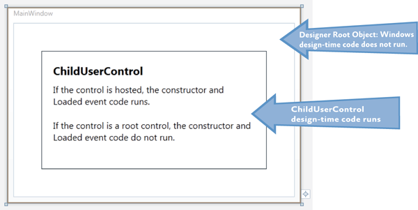

These concepts are important, especially if you are building composite applications or applications that are built dynamically at run time.

Most application views are coded and designed independently. Because they are designed independently, they are typically the root object in the designer. Because of this, their constructor and **Loaded** event code never executes.

However, if you take that same user control and place it on a design surface as a child of another control, the once isolated user control code is now executing at design time. If you have not followed the above practices for mitigating design-time code problems, the now hosted user control could become unfriendly and cause designer load issues.

#### Design-Time Properties

The built-in "d:" design-time properties provide a smooth road to a successful design-time tooling experience.

The problem we need to solve is how to provide a shape to the Binding Builder tools at design-time. In this case, the shape is an instantiated **Type** that the Binding Builder can reflect on, and then list those properties for selection when building a binding.

Shape is also provided by design-time sample data. Sample data is covered in the section, [Guidelines for Design-Time Sample Data](#guidelines-for-design-time-sample-data).

The following sections describe how to use the **d:DataContext** property and the **d:DesignInstance** markup extension.

The "d:" in the property and markup extension is the alias for the design namespace that the design properties are members of. For more information see the MSDN topic, [Design-Time Attributes in the WPF Designer](http://msdn.microsoft.com/en-us/library/ee839627.aspx).

The "d:" properties and markup extensions cannot be created or extended in user code; they can only be used in XAML. The "d:" properties and markup extensions are not compiled into your application; they are used only by the Visual Studio and Blend tooling.

##### d:DataContext Property

**d:DataContext**, specifies a design-time data context for a control and its children. When specifying **d:DataContext**, you should always provide the same shape to the design-time **DataContext** as the run-time **DataContext**.

If both a **DataContext** and a **d:DataContext** are specified for a control, the tooling will use the **d:DataContext**.

##### d:DesignInstance Markup Extension

If markup extensions are new to you, read [Markup Extensions and WPF XAML](http://msdn.microsoft.com/en-us/library/ms747254.aspx) on MSDN.

**d:DesignInstance** returns an instantiated Type ("shape") that you will want to assign as the data source for binding to controls in the designer. The type does not need to be creatable to be used for establishing shape. The following table explains the **d:DesignInstance** markup extension properties.

| **Markup Extension Property** | **Definition**                                                                                                            |
|-------------------------------|---------------------------------------------------------------------------------------------------------------------------|
| **Type**                      | Name of the Type that will be created. Type is the default parameter in the constructor.                                  |
| **IsDesignTimeCreatable**     | Can the specified Type be created? If false, a faux Type will be created rather than the real Type. The default is false. |
| **CreateList**                | If true, returns a generic list of the specified Type. The default is false.                                              |

##### Typical d:DataContext Scenario

The following three code examples demonstrate a repeatable pattern for wiring up views and view models and enabling the designer's tooling.

The **PersonViewModel** is a dependency that the **PersonView** has at run time. While the view model in the example is incredibly simple, real-world view models typically have one or more external dependencies that must be resolved, and those dependencies are typically injected into their constructor.

When the **PersonView** is constructed, its dependency **PersonViewModel** will be built and its dependencies resolved by MEF or a dependency injection container.

_**Note:** If the view model has no external dependencies that need to be resolved, the view model can be instantiated in the view's XAML, and its **DataContext** and the **d:DataContext** are not required._

```
// PersonViewModel.cs
[Export]
public class PersonViewModel 
{
    public String FirstName { get; set; }
    public String LasName { get; set; }
}
```

```
// PersonView.xaml.cs
[Export]
public partial class PersonView : UserControl
{
    public PersonView()
    {
        InitializeComponent();
    }

    [Import]
    public PersonViewModel ViewModel
    {
        get { return this.DataContext as PersonViewModel; }
        set { this.DataContext = value; }
    }
}
```

This is a good pattern for wiring up a view and view model; however, it leaves the view unaware of its **DataContext**'s shape (view model) at design time.

In the following XAML example, you can see the **d:DesignInstance** markup extension used on the **Grid** to return a faux instance of **PersonViewModel** that is then exposed by the **d:DataContext**. As a result, all child controls of the **Grid** will inherit the **d:DataContext**, enabling the designer tooling to discover and use its types and properties, resulting in a more productive design experience for developers and designers.

```
<!--PersonView.xaml -->
<UserControl
    xmlns:local="clr-namespace:WpfApplication1"
    x:Class="WpfApplication1.PersonView"
    xmlns="http://schemas.microsoft.com/winfx/2006/xaml/presentation"
    xmlns:x="http://schemas.microsoft.com/winfx/2006/xaml"
    xmlns:mc="http://schemas.openxmlformats.org/markup-compatibility/2006"
    xmlns:d="http://schemas.microsoft.com/expression/blend/2008"
    mc:Ignorable="d"
    d:DesignHeight="300" d:DesignWidth="300">

    <Border BorderBrush="LightGray" BorderThickness="1" CornerRadius="10" Padding="10">

        <Grid d:DataContext="{d:DesignInstance local:PersonViewModel}">
            <Grid.RowDefinitions>
                <RowDefinition Height="Auto" />
                <RowDefinition Height="Auto" />
            </Grid.RowDefinitions>

            <Grid.ColumnDefinitions>
                <ColumnDefinition Width="100" />
                <ColumnDefinition Width="Auto" />
            </Grid.ColumnDefinitions>
        
            <Label Grid.Column="0" Grid.Row="0" Content="First Name" />
            <Label Grid.Column="0" Grid.Row="1" Content="Las Name" />

            <TextBox
                Grid.Column="1" Grid.Row="0" Width="150" MaxLength="50"
                HorizontalAlignment="Left" VerticalAlignment="Top"
                Text="{Binding Path=FirstName, Mode=TwoWay}" />
            <TextBox 
                Grid.Column="1" Grid.Row="1" Width="150" MaxLength="50"
                HorizontalAlignment="Left" VerticalAlignment="Top"
                Text="{Binding Path=LasName, Mode=TwoWay}" />

        </Grid>
    </Border>

</UserControl>
```

_**Note**: **Attached Property and ViewModel Locator Solution**_

_There are several alternative techniques for associating a view and view model available from the developer community. One of the challenges is that solutions that work great at run time do not always work at design time. One such solution is the use of attached properties and view model locators to assign a view's **DataContext**. The view model locator is required so that the view model can be constructed and have its dependencies resolved._

_The problem with this solution is that you must also include the **d:DataContext** – **d:DesignInstance** combination because the visual designer tooling cannot be reflected in the results of the attached property the way that it can with the **d:DesignInstance**._

_Regardless of which technique you implement in your applications for resolving shape at design time, the most important goal is to be consistent throughout your application. Consistency will make application maintenance much easier and will lead to a successful designer-developer workflow._

### Guidelines for Design-Time Sample Data

The WPF and Silverlight Designer team published an in-depth, scenario-based training article that discusses the use of sample data in WPF and Silverlight projects. The article, [Sample Data in the WPF and Silverlight Designer](http://blogs.msdn.com/b/wpfsldesigner/archive/2010/06/30/sample-data-in-the-wpf-and-silverlight-designer.aspx), is available on MSDN.

#### Using Design-Time Sample Data

If you use a visual design tool, such as Blend or Visual Studio 2013, design-time sample data becomes very important. The views can be populated with data and images, making the design task easier and quicker to accomplish. This results in improved productivity and creativity.

Empty list controls that contain data templates will not be visible unless they are populated with data, making the task of editing the empty controls more time consuming because you need to run the application to see how the last edit will look at run time.

#### Sample Data Sources

You can use sample data from any of the following sources:

- Blend for Visual Studio 2013 XML sample data
- Blend for Visual Studio 2013 and Visual Studio 2013 XAML sample data
- XAML resources
- Code

The data from each of these sources is described in the following subsections.

##### Blend XML Sample Data

Blend gives you the capability to quickly create an XML schema and populate a corresponding XML file. This is accomplished without any dependency on any project classes.

The purpose of this type of sample data is to let designers start their projects quickly, without waiting for a developer or before application classes are available for consumption.

While most sample data is supported in both the Blend and Visual Studio designers, XML sample data is a Blend feature and does not render in the Visual Studio designer.

_**Note:** XML sample data file is not compiled or added to the assembly when built; however, the XML schema is compiled into the built assembly._

##### Blend for Visual Studio 2013 and Visual Studio 2013 XAML Sample Data

Beginning in Expression Blend 4 and Visual Studio 2010, the **d:DesignData** markup extension was added to enable the design-time loading of XAML sample data.

Sample data XAML files contain XAML that instantiates one or more types and assigns values to properties.

**d:DesignData** has a **Source** property that takes a uniform resource identifier (URI) to the sample data XAML file located in the project. The **d:DesignData** markup extension loads the XAML file, parses it, and then returns an object graph. The object graph can be consumed by the **d:DataContext** property, **CollectionViewSource d:DesignSource** property, or **DomainDataSource d:DesignData** property.

One of the challenges that the **d:DesignData** markup extension overcomes is that it can create sample data for non-creatable user types. For example, WCF Rich Internet Application (RIA) Services entity–derived objects cannot be created in code. In addition, developers might have their own types that are not creatable, but would still like to have sample data for these types.

You can change how **d:DesignData** processes your sample data file by setting the **Build Action** property on the sample data file in the **Solution Explorer** as follows:

- **Build Action = DesignData** – faux types will be created
- **Build Action = DesignDataWithDesignTimeCreatableTypes** – real types will be created

When Blend is used to create sample data for a class, it creates a XAML sample data file with the **Build Action** set to **DesignData**. If you require real types, open the solution in Visual Studio and change the **Build Action** for the sample data file to **DesignDataWithDesignTimeCreatableTypes**.

_**Note:** In the next illustration, the **Custom Tool** property is empty. This is required for sample data to work correctly. By default, Blend correctly sets this property to empty._

_When you use Visual Studio 2013 to add a sample data file, you typically add a new resource dictionary item and edit from there. In this case, you must set the **Build Action** and clear the **Custom Tool** property._

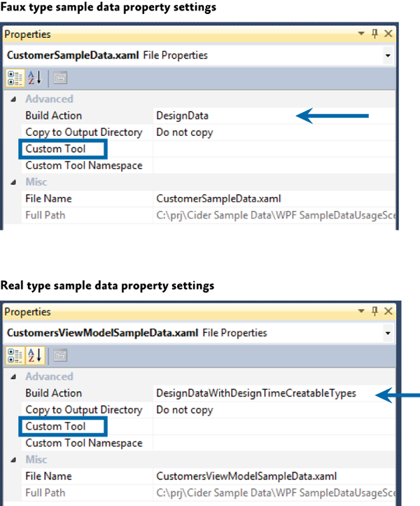

Expression Blend provides tooling for quickly creating and binding XAML sample data. The XAML sample data can be used and viewed in the Visual Studio 2013 designer, as shown in the following illustration.

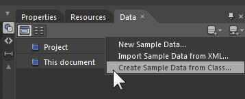

After it generates the sample data, the data will appear in the Data pane, as shown in the following illustration.

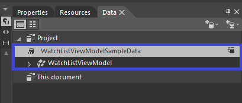

You can then drag it onto the root element of the view, such as the **UserControl**, and have it set the **d:DataContext** property. You can also drop sample data collections onto items controls, and Blend will wire up the sample data to the control.

_**Note**: XAML sample data files are not compiled into or included in built assemblies._

##### XAML Resource

You can create a resource in XAML that instantiates the desired types, and then bind that resource to a **DataContext** or list control.

This technique can be used to quickly create throw-away sample data that is used for editing a data template that would take longer to edit without the sample data.

##### Code

If you prefer creating sample data in code, you can write a class that exposes properties or methods that return sample data to their consumer. For example, you could write a **Customers** class that in its default empty constructor populated itself with multiple instances of the **Customer** class. Each of the **Customer** instances would have the appropriate property values set also.

One technique that you can use to consume the sample data class described previously is to use the **d:DataContext**, **d:DesignInstance** combination, ensuring that you set the **d:DesignInstance** **IsDesignTimeCreatable** property to **True**. The reason **IsDesignTimeCreatable** must be **True** is that you want the customers constructor to be executed so that the code to populate the class will run. If customers is treated as a faux type, the customers code will never be run and only the "shape" will be discoverable by the tooling.

The following XAML example instantiate the **Customers** class, and then sets it as the **d:DataContext**. Child controls of this **Grid** can consume data exposed by the **Customers** class.

```
<Grid d:DataContext="{d:DesignInstance local:Customers, IsDesignTimeCreatable=True}">
```

## UI Layout Key Decisions

When you begin a composite application project, there are some UI design decisions that you need to make that will be difficult to change later. Generally, these decisions are application-wide and their consistency helps developers and designer productivity.

The following are the important UI layout decisions:

- Decide on application flow and define regions accordingly.
- Decide which type of view loading each region will use.
- Decide if you want to use the Region Navigation APIs.
- Decide which UI Design pattern you will use (MVVM, presentation model, and so on).
- Decide on a sample data strategy.

## More Information

For more information about extending the Prism Library, see [Extending the Prism Library](AppendixE1-ExtendingPrism.md).

For more information about commands, see in [Commands](40-ImplementingtheMVVMPattern.md#commands) in [Implementing the MVVM Pattern](40-ImplementingtheMVVMPattern).

For more information about data binding, see in [Data Binding](40-ImplementingtheMVVMPattern.md#data-binding) in [Implementing the MVVM Pattern](40-ImplementingtheMVVMPattern).

For more information about region navigation, see [Navigation](60-Navigation.md).

For more information about the guidelines discussed in this topic, see the following:

- [Dependency Properties Overview](http://msdn.microsoft.com/en-us/library/ms752914.aspx) on MSDN.
- Data binding; see:
    - [Data Binding Overview](http://msdn.microsoft.com/en-us/library/ms742521.aspx) on MSDN.
    - [Data Binding in WPF](http://msdn.microsoft.com/en-us/magazine/cc163299.aspx) in *MSDN Magazine*.
- [Data Templating Overview](http://msdn.microsoft.com/en-us/library/ms742521.aspx) on MSDN.
- [Resources Overview](http://msdn.microsoft.com/en-us/library/ms750613.aspx) on MSDN.
- [UserControl Class](http://msdn.microsoft.com/en-us/library/system.windows.forms.usercontrol.aspx) on MSDN.
- [VisualStateManager Class](http://msdn.microsoft.com/en-us/library/cc626338(v=VS.95).aspx) on MSDN.
- [Customizing Controls For Windows Presentation Foundation](http://msdn.microsoft.com/en-us/magazine/cc163421.aspx) in *MSDN Magazine*.
- [ComponentResourceKey Markup Extension](http://msdn.microsoft.com/en-us/library/ms753186.aspx) on MSDN.
- [Design-Time Attributes in the WPF Designer](http://msdn.microsoft.com/en-us/library/ee839627.aspx) on MSDN.
- [Markup Extensions and WPF XAML](http://msdn.microsoft.com/en-us/library/ms747254.aspx) on MSDN.
- [Sample Data in the WPF and Silverlight Designer](http://blogs.msdn.com/b/wpfsldesigner/archive/2010/06/30/sample-data-in-the-wpf-and-silverlight-designer.aspx) on MSDN.
- [Learning the Visual Studio WPF and Silverlight Designer](http://blogs.msdn.com/b/wpfsldesigner/archive/2010/01/15/learn.aspx). This contains tutorials and articles on layout, resources, data binding, sample data, debugging data bindings, object data sources, and master-detail forms.

