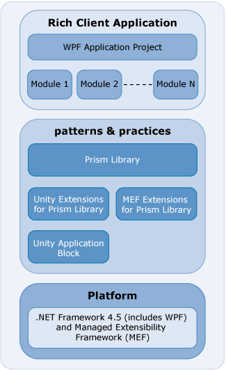

# Prism Library 5.0 for WPF 

The Prism Library helps architects and developers create composite applications for Windows Presentation Foundation (WPF) using the Model-View-ViewModel pattern. The Prism Library can support those wanting to build a number of application styles with WPF, but it is was primarily constructed for applications composed of discrete, functionally complete pieces that work together to create a single, integrated user interface (UI), often referred to as a composite application. The Prism Library accelerates the development of applications using proven design patterns. 

The Prism Library is primarily designed to help architects and developers create applications that need to accomplish the following:

 * Build clients composed of independent, yet cooperating, modules or pieces.
 * Separate the concerns of module builders from the concerns of the shell developer; by doing this, business units can concentrate on developing domain-specific modules instead of the WPF architecture.
 * Separate the concerns of presentation, presentation logic, and application model through support for presentation model patterns such as Model-View-ViewModel (MVVM).
 * Use an architectural infrastructure to produce a consistent and high quality integrated application.

When building your application with the Prism Library, you may use the Unity Extensions for the Prism Library and the Unity Application Block (Unity) or the Managed Extensibility Framework (MEF) Extensions for the Prism Library and MEF. These are built on the .NET Framework 4.5 for WPF, as shown in the following illustration.

The Prism Library addresses common requirements for building both composite and non-composite applications on the WPF platform. As a whole, the Prism Library accelerates development by providing the services and components to address these needs.

The Prism Library ships signed binaries through NuGet packages to allow you to take advantage of Prism immediately without the need to compile and as source in case you want to make modifications or just see how it works.

## Add Reference using NuGet and Accessing the Library Source Code

Add references to the Prism binaries in your code by searching NuGet for Prism. The [Prism](http://aka.ms/prism-wpf-Prism50Nuget) NuGet package is dependent on the [Prism.Composition](http://aka.ms/prism-wpf-Prism50CompositionNuget), [Prism.Interactivity](http://aka.ms/prism-wpf-Prism50InteractivityNuget), [Prism.Mvvm](http://aka.ms/prism-wpf-Prism50MvvmNuget), and [Prism.PubSubEvents](http://aka.ms/prism-wpf-Prism50PubSubEventsNuget) NuGet packages.

**Note:** The [Prism NuGet package](http://aka.ms/prism-wpf-Prism50Nuget) will download the Prism.Composition, Prism.PubSubEvents, Prism.Mvvm, and Prism.Interactivity NuGet packages.

## Organization of the Prism Library

 * **Microsoft.Practices.Prism.Composition**. This assembly contains interfaces and components to help build composite applications. These components include the **ModuleManager**, **ModuleCatalog**, and **Bootstrapper**. Additionally, this assembly contains the RegionManager component that helps compose the user interface from multiple parts..
 * **Microsoft.Practices.Prism.Interactivity**. This assembly contains behaviors and actions for interactions with the UI based on Blend for Visual Studio 2013 Behaviors (available in the Blend SDK), largely in support of the MVVM pattern. This includes **InteractionRequest**, **InteractionRequestTrigger**, **Confirmation**, and **Notification**. Additionally the PopupWindowAction responds to the **InteractionRequestTrigger**.
 * **Microsoft.Practices.Prism.UnityExtensions**. This assembly provides components to use the Unity Application Block (Unity) with the Prism Library. These components include **UnityBootstrapper** and **UnityServiceLocatorAdapter**.
 * **Microsoft.Practices.Prism.MefExtensions**. This assembly provides components to use Managed Extensibility Framework (MEF) with the Prism Library. These components include **MefBootstrapper** and **MefServiceLocatorAdapter**.
 * **Microsoft.Practices.Prism.PubSubEvents (Event Aggregator)**. This assembly contains interfaces and components to help send loosely coupled messages between modules. The components include the **PubSubEvents and EventAggregator**.
 * **Microsoft.Practices.Prism.Mvvm**. This assembly contains interfaces and components to help implement the MVVM pattern. These components include **BindableBase**, **PropertySupport**, **ViewModelLocationProvider**, **DelegateCommand**, and **CompositeCommand.**
 * **Microsoft.Practices.Prism.Mvvm.Desktop**. This assembly contains the components specific to WPF, which includes the platform specific dependency property called **AutoWireViewModelProperty**.
 * **Microsoft.Practices.Prism.SharedInterfaces.** This assembly contains the shared Prism interfaces **IActiveAware**.

## The Prism Library Source

The source for Prism.Composition, Prism.Interactivity, Prism.UnityExtensions, Prism.MefExtensions, Prism.SharedInterfaces, Prism.PubSubEvents, and Prism.Mvvm assemblies can be found in the PrismLibrary folder where Prism is installed. These assemblies target WPF applications.

## Modifying the Library

If you want to modify the Prism Library, you can replace the NuGet referenced assemblies with your own version of the binaries.

## Running the Tests

If you modify the Prism Library and want to verify that existing functionality is not broken, execute the unit tests for the projects. To run all the desktop unit tests in the solution file PrismLibrary\_Desktop.sln, on the **Test** menu, point to **Run**, and then click **All Tests in Solution**.

## More Information

Prism's community sites are:

 * Prism: <http://www.codeplex.com/Prism>.
 * PubSubEvents (Event Aggregator): <http://pnppubsub.codeplex.com>.
 * MVVM: <http://pnpmvvm.codeplex.com>.

For more information about Unity, see the following:

 * "Unity Application Block" on MSDN: <http://www.msdn.com/unity>.
 * Unity community site on CodePlex: <http://www.codeplex.com/unity>.

For more information about MEF, see the following:

 * "[Managed Extensibility Framework Overview](http://msdn.microsoft.com/en-us/library/dd460648.aspx)" on MSDN.
 * MEF community site on CodePlex: <http://mef.codeplex.com/>.

For more information about service locator, see the Common Service Locator on CodePlex: <http://commonservicelocator.codeplex.com/>.

