# Publishing and Updating Applications Using the Prism Library for WPF Hands-on Lab

In this lab, you will learn how to publish, deploy, and update a composite Prism Windows Presentation Foundation (WPF) application that uses dynamic module loading with ClickOnce. After completing this lab, you will be able to do the following:

- Publish an existing WPF Prism shell application project with ClickOnce.
- Add dynamically loaded modules to the published application for deployment.
- Deploy the application to a client computer.
- Publish an update to the application.
- Deploy the update to a client computer.

## System Requirements

This guidance was designed to run on the Microsoft Windows 8, Windows 7, Windows Vista, Windows Server 2012, or Windows Server 2008 operating system. WPF applications built using this guidance require the .NET Framework 4.5. 
Before you can use the Prism Library, the following must be installed:
- Microsoft Visual Studio 2013 Professional, Premium, or Ultimate editions
- Microsoft .NET Framework 4.5 (installed with Visual Studio 2013)
- Optional tool:
    - [Microsoft Blend for Visual Studio 2013](https://www.microsoft.com/expression/products/Blend_Overview.aspx)

## Preparation

This topic requires you to have Prism and the Prism QuickStarts in the default installed directory structure. This lab uses the ModularityWithUnity.Desktop QuickStart that is included with the Prism installed source code.

_**Note:** This hands-on lab uses the QuickStart that uses a Unity container, but you can also use the Managed Extensibility Framework (MEF) variant of the QuickStart._

**To compile the solution**

1. Open the solution file \\Quickstarts\\Modularity\\Desktop\\ModularityWithUnity\\ModularityWithUnity.Desktop.sln.
2. Build the solution.

Additionally, this lab uses the Manifest Manager Utility, which is available on the Prism CodePlex site at <http://compositewpf.codeplex.com/releases/view/14771> in the **Download** section. You will need to download and extract the source code for that utility, and build it to use it later in the lab. You can either run it from a separate instance of Visual Studio or you can build once and just run the binaries for the second task in this lab.

_**Note:** This hands-on lab assumes that you understand Prism modularity and deployment concepts. For more information, see [Modular Application Development](30-ModularApplicationDevelopment.md) and [Deploying Applications](90-DeployingPrismApplications.md)._

## Procedures

This lab includes the following tasks:

- Task 1: Publishing an initial version of the shell application
- Task 2: Updating the manifests to include dynamically loaded module assemblies
- Task 3: Deploying the initial version to a client machine
- Task 4: Publishing an updated version of the application and updating the manifests
- Task 5: Deploying the updated version to a client computer

The next sections describe each of these tasks.

_**Note:** The instructions for this hands-on lab are based on the ModularityWithUnity.Desktop solution._

## Task 1: Publishing an Initial Version of the Shell Application

In this task, you will publish the initial version of the shell application project using Visual Studio. The following steps will be performed:

1. **Set the ClickOnce publish settings**. In this task, you review and configure the project settings for the shell project that determine the ClickOnce deployment behavior.
2. **Add a publisher certificate**. In this task, you create a test publisher certificate to enable ClickOnce publishing and associate it with the application.
3. **Publish the application**. In this task, you physically publish the shell application from Visual Studio to a target deployment directory.
4. **Verify the published output**. In this task, you verify the output of the publication in the target directory.

The following procedure describes how to configure the ClickOnce publish settings within the shell project. These settings alter the behavior of ClickOnce, both at initial installation time and when setting the update policies for the application. The publish settings are only relevant for the shell project itself because it is the launch application executable, which determines the deployment behavior of the application as a whole in a ClickOnce deployed application.

**To set the ClickOnce publish settings**

1. In Visual Studio, open the project properties for the ModularityWithUnity.Desktop WPF project. To do this, right-click the project in Solution Explorer, and then click **Properties**. In the project settings, click the **Publish** tab. The ClickOnce publishing settings will be shown, as in the following illustration.

    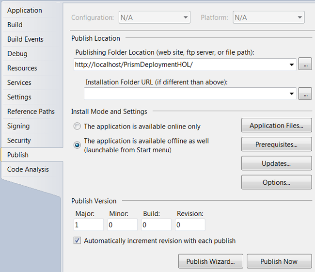
    
2. Change the publishing folder location to **http://localhost/PrismDeploymentHOL** if you have IIS on your local computer. If you do not, you can publish to another IIS computer for which you have administrator permissions to create a new virtual directory, or you can use a fully qualified Universal Naming Convention (UNC) file path (such as \\\\mymachinename\\c$\\PrismDeploymentHOL) if you first create that directory. The address used is the one that will be used to install the application later in the lab, so make sure you note the address. This address is the physical address you use to push the ClickOnce manifests and application files to the deployment server when you publish.

3. The installation folder URL can be used if the externally exposed address used for installation of the application will be different from the one used for publishing (for example, if you are publishing via FTP to one of your servers, but users will install the application based on an externally visible HTTP path to that server). This path represents the installation address on the deployment server to the users. If the path is not supplied, it is assumed you can launch the application using the same address you used to publish.

4. The install mode and settings provide you fine-grained options for configuring the way the application installs, what files it is composed of, if there are prerequisite installations that need to happen first (such as installing the .NET Framework 4.5), how updates are performed, and a number of other options. For this lab, you will use the default settings, which configures the application to install for offline use (meaning it can at least be launched even if you are not connected to the deployment server, but it depends on what your application does after launch as to whether it will function properly). The default settings also set the application to automatically update before launch if a new version is detected on the deployment server.

5. Click the **Updates** button, and then select check box labeled **The application should check for updates**, as shown in the following illustration.

    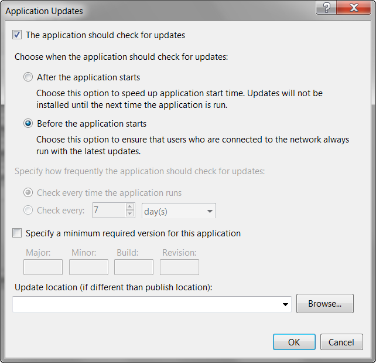
	
6. Click the **Options** button. In the **Options** dialog box, click **Manifests** in the left pane, and then select the check box labeled **Create desktop shortcut**.

    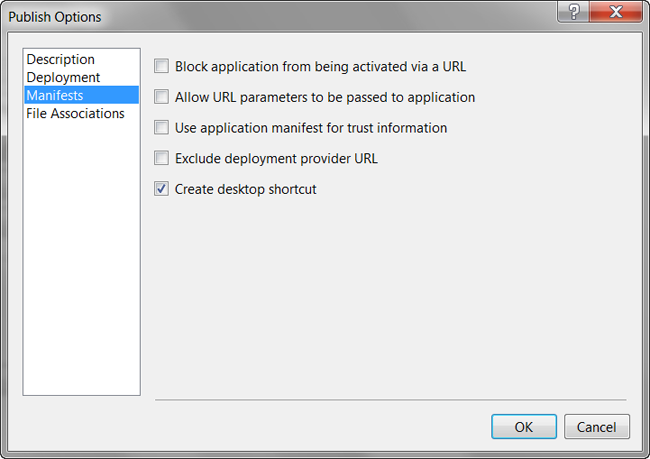

7. The publish version drives detection of updates for installed ClickOnce applications. Generally, you want to be in explicit control over this version in a real deployment. For this lab, you will allow Visual Studio to automatically increment this version number each time you publish.

The following procedure explains how to set up the certificate used for signing the published application. To ensure that your application cannot be replaced on the deployment server with a tampered version, ClickOnce requires you to digitally sign the ClickOnce manifests using an X509 code signing certificate. For development purposes, Visual Studio can generate a test certificate for your use. For putting your application into production, it is not recommended to use a test certificate. You should either obtain a certificate from a well-known (Trusted Root) certificate authority for public deployments or obtain one from your domain administrators for an internal deployment. In this lab, you will simply use the Visual Studio–generated test certificate.

**To add a publisher certificate**

1. In the shell project properties, click the **Signing** tab.

2. Select the check box labeled **Sign the ClickOnce manifests**. The certificate information will initially be blank if you have not previously created or associated a certificate with the project.

    

3. Click the **Create Test Certificate** button. This opens the Create Test Certificate dialog box, as shown in the following illustration.

    

4. Click **OK** to leave the test certificate without a password.

5. The certificate information should now be populated, and the certificate name and issuer will be based on your logged-on Windows account information. If you have an existing certificate as a file or already installed in your certificate stores, you can select the certificate using one of the buttons next to the certificate information instead.

**To publish the shell application**

1. Build the application and make sure it builds as expected. Publishing the application will cause the application to build, but it is easier to resolve any build errors with a normal build before publishing.

2. In Visual Studio, click **Publish ModularityWithUnity.Desktop** on the **Build** menu.

3. The **Publish Wizard** dialog box displays the publish folder location address that you entered in step 2, as shown in the following illustration. Click **Finish** to publish the application.

    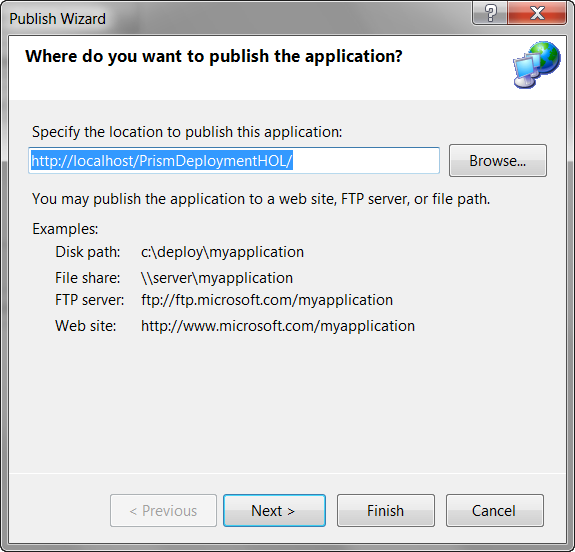

 _**Note:** Depending on the computer you publish to and the security settings, you may get a warning that Visual Studio is unable to view the published application. This simply means it was unable to launch a browser and navigate to the publish location URL. However, the application is not really ready to install yet at this point because you need to add the dynamic modules to the manifests in the next task._

## Task 2: Updating the Manifests to Include Dynamically Loaded Module Assemblies

In this task, you will edit the ClickOnce manifests of your deployed application to add the dynamic module assemblies. This involves editing the application files list in the application manifest, saving and re-signing the application manifest, updating the application manifest reference within the deployment manifest, and saving and re-signing the deployment manifest. These steps can all be performed individually using the .NET Framework SDK tool named the Manifest Generating and Editing tool (Mage). However, the Manifest Manager Utility that you can download from the Prism CodePlex site automates these steps into a single easy editor. To accomplish them, you will do the following:

1. **Open the deployment manifest in the Manifest Manager Utility**. In this task, you run the utility to simplify editing of the manifests.

 _**Important**: You must run this utility as an administrator._
 
2. **Add the dynamically loaded modules to the manifests**. In this task, you locate and add the dynamic module assemblies to the manifest and get them deployed to the publish location.

3. **Save and sign the manifests**. In this task, you select the publisher certificate used for signing the ClickOnce manifests to save and re-sign the manifests.

The following procedure describes how to add the dynamic module assemblies to the ClickOnce manifests.

**To open the deployment manifest in the Manifest Manager Utility**

1. If you have not already done so, download the most recent Manifest Manager Utility from the **Download** section of the Prism CodePlex site at <http://compositewpf.codeplex.com/releases/view/14771> and unzip it to a working directory on your computer.
2. In Visual Studio 2013, open the file ManifestManagerUtility.sln, build it, and run it.

 _**Important**: You must run this utility as an administrator. If you are running this from Visual Studio, you must start Visual Studio as an administrator._
 
3. On the **File** menu, click **Open**, and then navigate to the publish folder location where you published the QuickStart in the previous task. In that folder, select the deployment manifest file ModularityWithUnity.Desktop.application, and then click **Open**.

    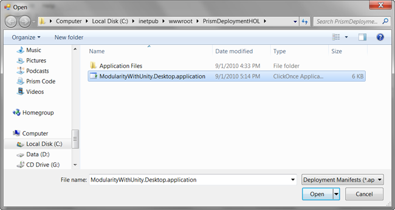

4. The deployment and linked application manifest files will be opened by the utility and will be presented in the unified view of the utility, as shown in the following illustration. You can see that the shell executable file and all referenced assemblies that are not part of the framework are automatically included. Note that Modules A and C are included because they were referenced for static loading by the QuickStart, but you will need to add the additional modules using the utility.

    

**To add the dynamically loaded modules to the manifest**

1. On the **Edit** menu, click **Add Files**. In the **Add Application Files** dialog box, navigate to the build output folder for Module B (such as C:\\temp\\ModularityWithUnity\\ModuleB\\bin\\Debug\\) and select the module DLL (such as ModularityWithUnity.Desktop.ModuleB.dll). In the **Add Application Files** dialog box, click **Open** to add the module DLL to the manifest.

2. When you click **Open**, a **Browse For Folder** dialog box appears. In this dialog box, you can specify the destination folder to copy the module file to the publish folder. Modules B and D are loaded in the QuickStart through directory scan, and the bootstrapper sets the folder it scans to a relative path of .\\DirectoryModules from the executable file. This means the files need to be in that same relative path in the published application.

3. Select the version-specific Application Files folder, and then click the **Make New Folder** button at the bottom of the dialog box.

4. Name the new folder DirectoryModules.

5. Make sure the new folder is selected, and then click **OK**. This copies the Module B DLL into the DirectoryModules subfolder of the application files, as shown in the following illustration.

    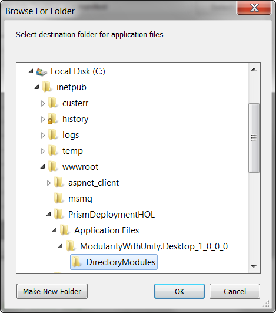
 
6. Repeat the preceding steps to add Module D to the manifest and place it in the DirectoryModules subfolder.

7. Repeat the preceding steps to add Modules E and F to the manifest, but those both go in the root Application Files folder (ModularityWithUnity.Desktop\_1\_0\_0\_0).

8. At this point, the additional modules should be listed in Manifest Manager Utility with the relative path shown for Modules B and D, as shown in the following illustration (order does not matter).

    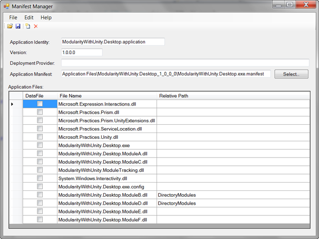

**To sign and save the manifests**

1. Click the **Save** button on the toolbar of the utility. This opens the **Select Publisher Certificate to Sign Manifest** dialog box.

    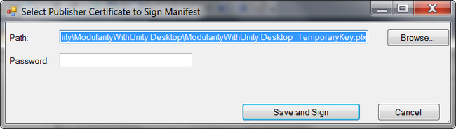
    
2. Click the **Browse** button, and then locate and select the ModularityWithUnity.Desktop\_TemporaryKey.pfx file that was generated when you added the test certificate to the project in the first task of this lab.

3. Click the **Save and Sign** button, leaving the password blank again.

At this point, you have successfully published the application with modified manifest files and it is ready to install.

## Task 3: Deploying the Initial Version to a Client Computer

In this task, you will launch and install the application.

**To launch and install the application**

1. Open an Internet Explorer browser window and enter the address you used as the publish folder location with the deployment manifest (.application file) path added to the end of it (such as http://localhost/PrismDeploymentHOL/ModularityWithUnity.Desktop.application).

2. A **Launching Application** dialog box briefly appears as ClickOnce downloads the manifests for the application, as shown in the following illustration.

    

3. A security warning appears, as shown in the following illustration. It notifies the user of who the publisher of this application is. Because you are using a test certificate, it will show an unknown publisher. To get a more friendly security warning, you will need a certificate issued from a trusted root certification authority.

    

4. Click **Install.** While the rest of the application files are downloaded and launched, you will briefly see a dialog box with a progress bar, as shown in the following illustration.

    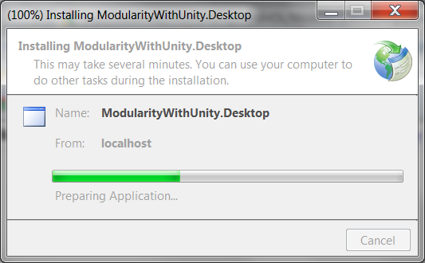

5. The QuickStart should launch and you should see Modules A and D load when it starts. You can click on the other squares to get the other modules to load on demand.

    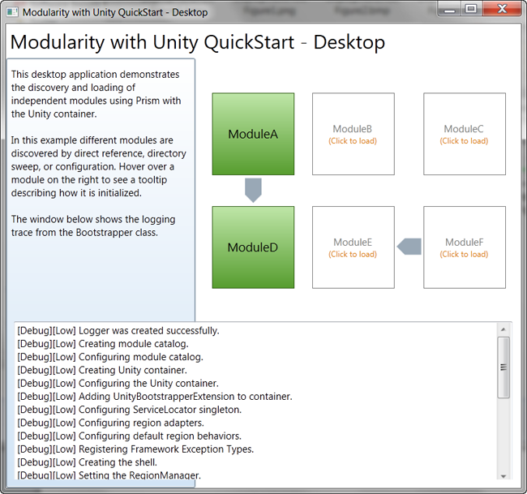

## Task 4: Publishing an Updated Version of the Application and Updating the Manifests

In this task, you will make a simple visible change to the application and publish the new version. To accomplish this, you will do the following:

1. **Modify the title of the application**. In this task, you will modify the large text at the top of the application to indicate a modified version. This gives a simple visible change to the application so you can verify the updated application launches in the next task.
2. **Publish the new version of the application**. In this task, you publish the application again with a new publish version so that the ClickOnce update checking will see that there is a new version of the application on the deployment server.
3. **Update the manifests**. In this task, you will use the manifest manager utility again to re-add Modules B, D, E, and F to the deployment because each time you re-publish, the manifest is re-generated by Visual Studio based on the referenced assemblies from the shell.

The following procedure describes how to publish the updated version.

**To modify the title of the application**

1. With the ModularityWithUnity.Desktop project open, open the Shell.xaml file in the designer.
2. Modify the **Title** property of the window to read **Modularity with Unity QuickStart – Desktop – Modified**.
3. Save and build the solution.

**To publish the new version of the application**

1. On the **Build** menu, click **Publish ModularityWithUnity.Desktop**.
2. In the Publish Wizard, click **Finish**.
3. The new version will be published and the publish version number will be 1.0.0.1 because Visual Studio auto-incremented the publish version when you first published in Task 1.

**To update the manifests for the new version**

1. Open Manifest Manager Utility again.
2. On the **File** menu, click **Open**, and then locate and open the ModularityWithUnity.Desktop.application deployment manifest again (Manifest Manager Utility should remember the location from the last time you opened a manifest). You should see that the manifest version is now 1.0.0.1 and Modules B, D, E, and F are missing again.
3. On the **Edit** menu, click **Add Files** to select the Modules B assembly.
4. When the **Browse For Folder** dialog box appears, go to the new published version's Application Files folder (ModularityWithUnity.Desktop\_1\_0\_0\_1), create a DirectoryModules subfolder, and then select it to place Module B in that relative path.
5. Repeat steps 3 and 4 for Module D, also putting it into the DirectoryModules subfolder.
6. Repeat steps 3 and 4 for Modules E and F, but place them in the ModularityWithUnity.Desktop\_1\_0\_0\_1 directory, not the DirectoryModules subfolder.
7. On the toolbar, click the **Save** button.
8. Manifest Manager Utility should remember the path to the publisher certificate file you used to publish the first version, so you can just click the **Save and Sign** button.

The new version is published and ready to deploy.

## Task 5: Deploying the Updated Version to a Client Computer

In this task, you will launch the application as the client computer and see that it automatically updates.

**To deploy the updated version to a client computer**

1. Locate the shortcut on your desktop that was created when you installed the initial version of the application (ModularityWithUnity.Desktop), and then click it to launch the application from the client computer.

2. The Update Available dialog box appears, as shown in the following illustration. Click **OK** to accept the update.

    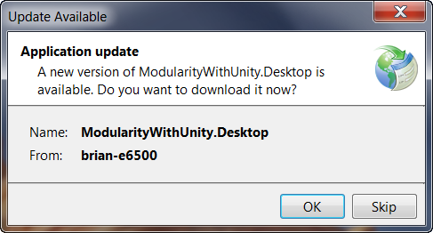

You should see the modified title on the application after it has launched.
