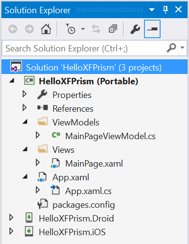
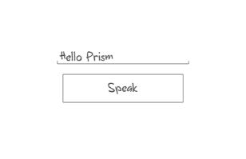

#Getting started with Prism for Xamarin.Forms
##Content
 - [Overview](#overview)
 - [Prerequisites](#prerequisites)
 - [Background](#background)
	 - Xamarin.Forms
	 - MVVM
 - [Creating a new solution](#creating-a-new-solution)
	 - Installing and using the Prism Template Pack
	 - Running the app
	 - Views overview
	 - View Models overview
 - [Adding a new Page (View) and ViewModel](#adding-a-new-page-view-and-viewmodel)
 - [Navigating to your new Page](#navigating-to-your-new-page)

##Overview
This guide will walk you through creating a new Xamarin.Forms project that uses Prism, running the application, and modifying it to demonstrate basic use of Prism for Xamarin.Forms.

##Prerequisites
This guide assumes that you have Xamarin, Xamarin Android Player, and Visual Studio 2015 already installed along with a basic understanding of those technologies. If you do not, please take a look at the excellent resources available at [xamarin.com](xamarin.com) and [visualstudio.com](visualstudio.com).

##Background
###What's Xamarin.Forms?
> Build native UIs for iOS, Android and Windows
from a single, shared C# codebase.

Xamarin.Forms allows you to build applications for iOS, Android and Windows that share both back and front end code. For more information take a look at [Xamarin.Forms](https://xamarin.com/forms).


###What's MVVM?
MVVM stands for Model View ViewModel and it is a design pattern that allows for clean separation of concerns between the user interface and the model behind it. A major advantage of MVVM is that it leverages data-binding to display information and respond to user input.

The following diagram shows the interaction between the components in MVVM.


For more information reference [The MVVM Pattern](https://msdn.microsoft.com/en-us/library/hh848246.aspx) by Microsoft Patterns & Practices

##Creating a new solution
###Installing and using the Prism Template Pack
The easiest way to get a new solution up and running is with the *Prism Template Pack*. Let's start by installing it in Visual Studio.

Go to `Tools > Extensions and Updates` select `Online` and search for *Prism Template Pack*. Locate the the extensions, click `Download`, and complete the installation. Click the `Restart Now` button.

Now that we have the Template Pack installed, lets create a new solution. Go to `File > New > Project...` select `Installed > Templates > Visual C# > Prism`.  Here you will find all the templates available for a new Prism project/solution.

Select `Prism Unity App (Forms) Visual C#` fill in the name of your project/solution and click `OK`

A new solution was created with a Portable Class Library (PCL) project labeled `(Portable)` and device-dependent projects (Android, iOS, Windows Phone). NuGet packages were added to these projects for Xamarin.Forms, Prism, and Prism.Unity along with all their dependencies.



####Running the app
**Android**

Right click on the Android project and select set as startup project. Also ensure build and deploy are both checked for the Android project in the Configuration Manager.

Open the Xamarin Android Player and ensure that a device image is installed and note the API level of the device image.

Open the Android project properties and change the Minimum Android to target to be equal or less than the API level of the device image you will be running on.

Select the Android Player device from the Debug drop down menu and click the debug play button.

**iOS**

To be added.

**Windows Phone**

To be added.

####Views
Within the Portable project there is a `View` folder. This folder will contain all of your view related code. The template created a [Content Page](https://developer.xamarin.com/guides/xamarin-forms/controls/pages/) called `MainPage.xaml` in this folder.  Lets take a look at this file.

```xaml
<?xml version="1.0" encoding="utf-8" ?>
<ContentPage xmlns="http://xamarin.com/schemas/2014/forms"
             xmlns:x="http://schemas.microsoft.com/winfx/2009/xaml"
             xmlns:prism="clr-namespace:Prism.Mvvm;assembly=Prism.Forms"
             prism:ViewModelLocator.AutowireViewModel="True"
             x:Class="GettingStartedWithPrismForXamarinForms.Views.MainPage"
             Title="MainPage">
  <StackLayout HorizontalOptions="Center" VerticalOptions="Center">
    <Label Text="{Binding Title}" />
  </StackLayout>
</ContentPage>
```

There are some important things happening here, let's break down whats going on.

`xmlns:prism="clr-namespace:Prism.Mvvm;assembly=Prism.Forms"`

The Prism library is referenced. 

`prism:ViewModelLocator.AutowireViewModel="True"`

This view (MainPage.xaml) is wired to the view model (MainPageViewModel.cs) *automatically via naming conventions* allowing for databinding to the view model. See [ViewModelLocator documentation](https://github.com/PrismLibrary/Prism/blob/master/Documentation/Xamarin.Forms/2-ViewModelLocator.md) for more information.

`<Label Text="{Binding Title}" />`

A label is created on the page with the text bound to the property named Title in the view model (MainPageViewModel.cs).

####View Models
Within the Portable project there is a `ViewModels` folder. This folder will contain all of your view model related code. The template created a view model for the MainPage called `MainPageViewModel.cs` in this folder.  Lets take a look at this class and break down what is going on here.
```cs
public class MainPageViewModel : BindableBase, INavigationAware
{
    private string _title;
    public string Title
    {
        get { return _title; }
        set { SetProperty(ref _title, value); }
    }

    public void OnNavigatedFrom(NavigationParameters parameters){}

    public void OnNavigatedTo(NavigationParameters parameters)
    {
        if (parameters.ContainsKey("title"))
            Title = (string)parameters["title"] + " and Prism";
    }
}
```

```cs
public class MainPageViewModel : BindableBase, INavigationAware
```
The MainPageViewModel inherits from `BindableBase` and implements the `INavigationAware` interface. 

The `BindableBase` class implements the [INotifyPropertyChanged](https://msdn.microsoft.com/en-us/library/system.componentmodel.inotifypropertychanged%28v=vs.110%29.aspx) interface which allows for the view to be able to databind to properties created here. `BindableBase` also provides a protected `SetProperty` method to simplify creating these properties. 

The `INavigationAware` interface allows for the view model to be notified when it is being navigated from or being navigated to. See the [INavigationAware documentation](https://github.com/PrismLibrary/Prism/blob/master/Documentation/Xamarin.Forms/3-NavigationService.md#inavigationaware) for more information.

```cs
private string _title;
public string Title
{
    get { return _title; }
    set { SetProperty(ref _title, value); }
}
```

Creates a public property named Title that triggers the OnPropertyChanged event when the value is set.

```cs
public void OnNavigatedFrom(NavigationParameters parameters){}

...

public void OnNavigatedTo(NavigationParameters parameters)
{
...
```
These methods are called with the view model is navigated from or to. Here it expects a string via the NavigationParameters parameter and modifies the Title property with the string's value. See the [INavigationAware documentation](https://github.com/PrismLibrary/Prism/blob/master/Documentation/Xamarin.Forms/3-NavigationService.md#inavigationaware) for more information.

##Adding a new Page (View) and ViewModel
Now that we have a basic understanding of how project is setup with Prism for Xamarin.Forms, let's add to it and create a new Page (View) and ViewModel. We'll create a page with a text entry field and a button similar to the wireframe below. Later we'll add functionality to make the phone speak the text that's entered into the text field.



###View
Let's create the new content page in the project, also known as the view. Again, the easiest way to do this is with the *Prism Template Pack*. We'll create the view first. Right click on the `Views` folder, click `Add > New Item...` under `Installed > Visual C# > Prism > Forms` select `Prism ContentPage (Forms)`. Name the page `SpeakPage.xaml` and click `Add`. This creates a blank content page. 

There are many different types of [pages available in Xamarin Forms](https://developer.xamarin.com/guides/xamarin-forms/controls/pages/), but the ContentPage is one of the most basic. It displays a single visual object, typically a [layout](https://developer.xamarin.com/guides/xamarin-forms/controls/layouts/). Update`PrismContentPage.xaml` to have the contents shown below.

```xaml
<?xml version="1.0" encoding="utf-8" ?>
<ContentPage xmlns="http://xamarin.com/schemas/2014/forms"
             xmlns:x="http://schemas.microsoft.com/winfx/2009/
             xmlns:prism="clr-namespace:Prism.Mvvm;assembly=Prism.Forms"
             prism:ViewModelLocator.AutowireViewModel="True"
             x:Class="HelloXFPrism.Views.PrismContentPage">
  <StackLayout VerticalOptions="CenterAndExpand">
    <Entry Text="{Binding TextToSay}" />
    <Button Text="Speak" Command="{Binding SpeakCommand}"/>
  </StackLayout>
</ContentPage>
```

Let's break down what is going on here.

`xmlns:prism="clr-namespace:Prism.Mvvm;assembly=Prism.Forms"`
The Prism library is referenced. 

`prism:ViewModelLocator.AutowireViewModel="True"`
This view (PrismContentPage.xaml) is wired to the view model (PrismContentPageViewModel.cs) *automatically via naming conventions* allowing for databinding to the view model. See [ViewModelLocator documentation](https://github.com/PrismLibrary/Prism/blob/master/Documentation/Xamarin.Forms/2-ViewModelLocator.md) for more information.

``` <StackLayout VerticalOptions="CenterAndExpand">
...
</StackLayout>```
This sets the ContentPage's view to a [StackLayout](https://developer.xamarin.com/api/type/Xamarin.Forms.StackLayout/). A StackLayout positions it's child elements each on a single line, stacking them either horizontally or vertically. This is a very common layout used within Xamarin Forms. We're using it along with it's VerticalOptions set to CenterAndExpand so the child elements show up as stacked vertically and centered as shown in the wireframe above.

`<Entry Text="{Binding TextToSay}" />`
An [Entry](https://developer.xamarin.com/api/type/Xamarin.Forms.Entry/) is provided that allows the user to enter text. The text that is entered is data-bound to a property named TextToSay in the PrismContentPageViewModel, which we'll create soon.

`<Button Text="Speak" Command="{Binding SpeakCommand}"/>`
A [Button](https://developer.xamarin.com/api/type/Xamarin.Forms.Button/) is placed below the Entry. The button's command is executed when it is clicked and is bound to a command named SpeakCommand in the PrismContentPageViewModel, which we'll create soon.

###View Model
Now that we have a view named PrismContentPage, we'll add it's corresponding view model. As with all the other steps, the easiest way to create a view model is with the *Prism Template Pack*. Right click on the `ViewModels` folder, click `Add > New Item...` under `Installed > Visual C# > Prism > Forms` select `Prism ViewModel`. Name the page `SpeakPageViewModel.cs` and click `Add`. This creates a view model for the SpeakPage. Update `SpeakPageViewModel.cs` to have the following contents within the namespace.

```cs
namespace HelloXFPrism.ViewModels
{
    using Prism.Commands;
    using Prism.Mvvm;

    public class SpeakViewModel : BindableBase
    {
        private string _textToSay = "Hello Prism";
        public string TextToSay
        {
            get { return _textToSay; }
            set { SetProperty(ref _textToSay, value); }
        }

        public DelegateCommand SpeakCommand { get; set; }

        public SpeakViewModel()
        {
            SpeakCommand = new DelegateCommand(Speak);
        }

        private void Speak()
        {
            //TODO: call service
        }
    }
}
```

Let's break down what is going on here.

```cs
private string _textToSay = "Hello Prism";
public string TextToSay
{
    get { return _textToSay; }
    set { SetProperty(ref _textToSay, value); }
}
```

Creates a string property that the text entry field is bound to. The initial text is "Hello Prism". `SetProperty` is provided by Prism to simplify creating bindable properties. See the ViewModels section of this document for more information.

```cs
public DelegateCommand SpeakCommand { get; set; }

public SpeakViewModel()
{
    SpeakCommand = new DelegateCommand(Speak);
}
```

Creates a [DelegateCommand](https://msdn.microsoft.com/en-us/library/microsoft.practices.prism.commands.delegatecommand%28v=pandp.50%29.aspx) called `SpeakCommand` that the Speak button is bound to. The `SpeakCommand` is created in the `SpeakViewModel` constructor and will invoke the `Speak` method, which hasn't been written yet. To be able to perform the actual text-to-speech platform specific APIs need to be used. This is outside the scope of this documentation, but head over to the [Dependency Service documentation](/Documentation/Xamarin.Forms/5-DependencyService.md) to see how this is done.

##Navigating to your new page
We now have two pages in our app, a main page and a speak page. To navigate to the new page, we'll need to register the page for navigation. In the Portable Class Library, `HelloXFPrism (Portable)`, open App.xaml.cs (you may have to click the carrot next to App.xaml to see it). Register the new page for navigation by updating `RegisterTypes()` to include the following.
```cs
Container.RegisterTypeForNavigation<SpeakPage>();
```
You can now navigate to the new page so let's setup MainPage to navigate. In `MainPage.xaml` add a button below the existing label.
```xaml
<Button Text="Navigate to speak page" Command="{Binding NavigateToSpeakPageCommand}" />
```

Now we need to update MainPage's view model to include the `NavigateToSpeakPageCommand` and perform navigation. Update `MainPageViewModel.cs` to *include* the following.

```cs
private INavigationService _navigationService;

public DelegateCommand NavigateToSpeakPageCommand { get; private set; }

public MainPageViewModel(INavigationService navigationService)
{
    _navigationService = navigationService;
    NavigateToSpeakPageCommand = new DelegateCommand(NavigateToSpeakPage);
}

private void NavigateToSpeakPage()
{
    _navigationService.Navigate("SpeakPage");
}
```

Let's break down what's going on here.

```cs
public MainPageViewModel(INavigationService navigationService)
{
    _navigationService = navigationService;
    NavigateToSpeakPageCommand = new DelegateCommand(NavigateToSpeakPage);
}
```

Using dependency injection, gets the navigation service and also creates the NavigateToSpeakPageCommand.

```cs
private void NavigateToSpeakPage()
{
    _navigationService.Navigate("SpeakPage");
}
```

Tells the navigation service to navigate to the SpeakPage.

With navigation all wired up and the "Navigate to speak page" button is pressed in the view the NavigateToSpeakPageCommand will be called on the view model, the command will execute the NavigateToSpeakPage method, and finally the Navigation Service will perform the navigation to the SpeakPage.

For more information on the navigation service see the [navigation service documentation](https://github.com/PrismLibrary/Prism/blob/master/Documentation/Xamarin.Forms/3-NavigationService.md)
