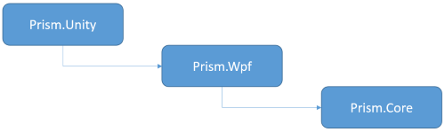

# Prism
Prism is a framework for building loosely coupled, maintainable, and testable XAML applications in WPF, Windows 10 UWP, and Xamarin Forms. Separate releases are available for each platform and those will be developed on independent timelines. Prism provides an implementation of a collection of design patterns that are helpful in writing well-structured and maintainable XAML applications, including MVVM, dependency injection, commands, EventAggregator, and others. Prism's core functionality is a shared code base in a Portable Class Library targeting these platforms. Those things that need to be platform specific are implemented in the respective libraries for the target platform. Prism also provides great integration of these patterns with the target platform. For example, Prism for UWP and Xamarin Forms allows you to use an abstraction for navigation that is unit testable, but that layers on top of the platform concepts and APIs for navigation so that you can fully leverage what the platform itself has to offer, but done in the MVVM way.

Prism 6 is a fully open source version of the Prism guidance [originally produced by Microsoft patterns & practices](http://blogs.msdn.com/b/dotnet/archive/2015/03/19/prism-grows-up.aspx). The core team members were all part of the p&p team that developed Prism 1 through 5, and the effort has now been turned over to the open source community to keep it alive and thriving to support the .NET community. There are thousands of companies who have adopted previous versions of Prism for WPF, Silverlight, and Windows Runtime, and we hope they will continue to move along with us as we continue to evolve and enhance the framework to keep pace with current platform capabilities and requirements.

At the current time we have no plans to create new versions of the library for Silverlight or for Windows 8/8.1/WP8.1. For those you can still use the previous releases from Microsoft p&p [here](https://msdn.microsoft.com/en-us/library/Gg430869%28v=PandP.40%29.aspx) and [here](http://prismwindowsruntime.codeplex.com/). If there is enough interest and contributors to do the work, we can consider it, but it is not on our roadmap for now.

# Build Status

|          | Status |
| -------- | ------ |
| Prism |  |
| Prism.Wpf |  |
| Prism.Windows |  |
| Prism.Forms |  |

# Support
- Join our Slack Channel 
- Documenation is maintained in this repo under /docs and can be found in a readable format on [Read the Docs](http://prismlibrary.readthedocs.io/en/latest/).
- For general questions and support, post your questions on [StackOverflow](http://stackoverflow.com/questions/tagged/prism)
- You can enter bugs and feature requests in our [Issues](https://github.com/PrismLibrary/Prism/issues).

#Help Support Prism

As most of you know, it takes a lot of time and effort for our small team to manage and maintain Prism in our spare time.  Even though Prism is open source and hosted on GitHub, there are a number of costs associated with maintaining a project such as Prism.  If you would like to help support us, the easiest thing you can do is watch our Pluralsight courses on Prism.  By watching our courses, not only do you help support the project financially, but you might also learn something along the way.  We believe this is a win-win for everyone.

* [Building Windows Store Business Apps with Prism](https://app.pluralsight.com/library/courses/building-windows-store-business-applications-prism/table-of-contents)
* [Introduction to Prism](https://app.pluralsight.com/library/courses/prism-introduction/table-of-contents)
* [What's New in Prism 5.0](https://app.pluralsight.com/library/courses/prism-50-whats-new/table-of-contents)
* [Prism Problems & Solutions: Showing Multiple Shells](https://app.pluralsight.com/library/courses/prism-showing-multiple-shells/table-of-contents)
* [Prism Problems & Solutions: Mastering TabControl](https://app.pluralsight.com/library/courses/prism-mastering-tabcontrol/table-of-contents)
* [Prism Problems & Solutions: Loading Modules Based on User Roles](https://app.pluralsight.com/library/courses/prism-loading-modules-user-roles/table-of-contents)
* [Prism Problems & Solutions: Loading Dependent Views](https://app.pluralsight.com/library/courses/prism-problems-solutions/table-of-contents)

We appreciate your support.

#NuGet Packages
### Core Packages

These are the base packages for each platform, together with the Prism's Core assembly as a cross-platform PCL.

| Platform | Assembly | Package | Version |
| -------- | -------- | ------- | ------- |
| PCL | Prism.dll | [Prism.Core][1] | [![21]][1] |
| WPF | Prism.Wpf.dll | [Prism.Wpf][2] | [![22]][2] |
| Xamarin.Forms | Prism.Forms.dll | [Prism.Forms][3] | [![23]][3] |
| Windows 10 UWP | Prism.Windows.dll | [Prism.Windows][4] | [![24]][4] |

### Container-specific packages

Each supported IoC container has its own package assisting in the setup and usage of that container together with Prism. The assembly is named using this convention: Prism.*Container.Platform*.dll, e.g. **Prism.Unity.Wpf.dll**. 

Following matrix shows the platform specific support currently available.

| Package                | Version    | WPF | Win10 UWP | Xamarin.Forms |
|------------------------|------------|:---:|:---:|:---:|
| [Prism.Autofac][7] (*)  | [![27]][7] |  X  |  X  |  &darr;  |
| [Prism.Autofac.Forms][12]   | [![32]][12] |  -  |  -  |  X  |
| [Prism.DryIoc.Forms][13]   | [![33]][13] |  -  |  -  |  X  |
| [Prism.Mef][6]  (**) | [![26]][6] |  X  | - | - |
| [Prism.Ninject][9] (*)   | [![29]][9] |  X  |     |  &darr;  |
| [Prism.Ninject.Forms][11]| [![31]][11]|  -  |  -  |  X  |
| [Prism.StructureMap][8]| [![28]][8] |  X  |     |     |
| [Prism.Unity][5] (*)  | [![25]][5] |  X  |  X  |  &darr;  |
| [Prism.Unity.Forms][10]| [![30]][10]|  -  |  -  |  X  |

(*) As Xamarin Forms also supports UWP now, adding Prism.Unity, Prism.Ninject, or Prism.Autofac puts in some incorrect dependencies. Therefore we created a new package for Xamarin Forms projects. 

(**) MEF is supported with WPF for compatibility with previous versions. It will not be added to Windows 10 UWP or Xamarin Forms.

Note that adding the container-specific package to your project, will also pull in the correct platform-specific package and the core PCL library. E.g. when you'd like to use Unity in a WPF project, add the Prism.Unity package and the rest will be pulled in as well.

A detailed overview of each assembly per package is available [here](docs/DownloadandSetupPrism.md#overview-of-assemblies).

# Prism Template Pack
Prism now integrates with Visual Studio and Xamarin Studio to enable a highly productive developer workflow for creating WPF, UWP, and native iOS and Android applications using Xamarin.Forms.  Jump start your Prism apps with code snippets, item templates, and project templates for your IDE of choice.

### Visual Studio Gallery
The Prism Template Pack is available on the [Visual Studio Gallery](https://visualstudiogallery.msdn.microsoft.com/e7b6bde2-ba59-43dd-9d14-58409940ffa0).  To install, just go to Visual Studio -> Tools -> Extensions and Updates... then search for **Prism** in the online gallery:

### Xamarin Studio Addin
Installation is straightforward if you've installed Xamarin Add-ins before, just go to  Xamarin Studio -> Add-In Manager...  from the Menu and then search for  **Prism**  from the Gallery:

# Samples
We have both a development sandbox (frequently changing) and stable samples for using Prism with WPF, UWP and Xamarin Forms. An overview of the samples can be found [here](Sandbox/README.md).

#Contributing
We strongly encourage you to get involved and help us evolve the code base. 
- You can see what our expectations are for pull requests [here](https://github.com/PrismLibrary/Prism/blob/master/.github/CONTRIBUTING.md).

### .NET Foundation

This project is part of the [.NET Foundation](http://www.dotnetfoundation.org/projects).

[1]: https://www.nuget.org/packages/Prism.Core/
[2]: https://www.nuget.org/packages/Prism.Wpf/
[3]: https://www.nuget.org/packages/Prism.Forms/
[4]: https://www.nuget.org/packages/Prism.Windows/
[5]: https://www.nuget.org/packages/Prism.Unity/
[6]: https://www.nuget.org/packages/Prism.Mef/
[7]: https://www.nuget.org/packages/Prism.Autofac/
[8]: https://www.nuget.org/packages/Prism.StructureMap/
[9]: https://www.nuget.org/packages/Prism.Ninject/
[10]: https://www.nuget.org/packages/Prism.Unity.Forms/
[11]: https://www.nuget.org/packages/Prism.Ninject.Forms/
[12]: https://www.nuget.org/packages/Prism.Autofac.Forms/
[13]: https://www.nuget.org/packages/Prism.DryIoc.Forms/

[21]: https://img.shields.io/nuget/vpre/Prism.Core.svg
[22]: https://img.shields.io/nuget/vpre/Prism.Wpf.svg
[23]: https://img.shields.io/nuget/vpre/Prism.Forms.svg
[24]: https://img.shields.io/nuget/vpre/Prism.Windows.svg
[25]: https://img.shields.io/nuget/vpre/Prism.Unity.svg
[26]: https://img.shields.io/nuget/vpre/Prism.Mef.svg
[27]: https://img.shields.io/nuget/vpre/Prism.Autofac.svg
[28]: https://img.shields.io/nuget/vpre/Prism.StructureMap.svg
[29]: https://img.shields.io/nuget/vpre/Prism.Ninject.svg
[30]: https://img.shields.io/nuget/vpre/Prism.Unity.Forms.svg
[31]: https://img.shields.io/nuget/vpre/Prism.Ninject.Forms.svg
[32]: https://img.shields.io/nuget/vpre/Prism.Autofac.Forms.svg
[33]: https://img.shields.io/nuget/vpre/Prism.DryIoc.Forms.svg