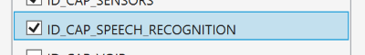

#Using the DependencyService with Prism

Xamarin.Forms includes a DependencyService to let shared code to easily resolve Interfaces to platform-specific implementations, allowing you to access features of the iOS, Android and Windows Phone SDKs from your PCL or Shared Project.

The **problem** with Xamarin's DependencyService is that it requires a static call to DependencyService.Get<> in your shared code to get a platform-specific instance of the interface at run time.  This makes your ViewModels less testable, and hides the dependencies of your class.

Prism **simplifies** this feature by allowing you to simply request any dependencies that have been registered with Xamarin's DependencyService via your class constructor.

```
public MainPageViewModel(ITextToSpeech textToSpeechService)
{
    textToSpeechService.Speak("Hello World");
}
```
You can also gain access to Xamarin's DependencyService by using the **IDependencyService** interface.  This interface removes the static call in your ViewModel, but still gives you access to Xamarin's DependencyService API.
```
public MainPageViewModel(IDependencyService dependencyService)
{
    dependencyService.Get<ITextToSpeech>().Speak("Hello World");
}
```

# Example

### Step 1: Create Project
Create a new Xamarin.Forms Portable or Shared project.

### Step 2: Add Prism
Use Nuget to add Prism to each of your projects in the solution.

Add the Following Nuget packages to your projects.
* [Prism.Unity.Forms](https://www.nuget.org/packages/Prism.Unity.Forms/)
* [Prism.Forms](https://www.nuget.org/packages/Prism.Forms/)
* [Prism.Core](https://www.nuget.org/packages/Prism.Core/)
        
_Hint: If you add the **Prism.Unity.Forms** NuGet package first, it will bring in the other Prism packages automatically._

### Step 3: Add a Service
In this examples, we will leverage the speech API of each platform to provide text to speech capabilities to our application.  This means we need to create a service for each platform that will invoke that specific platform's speech API.

This will require two steps:

* Add an interface to the Portable project that will define the contract for our speech service:

```
public interface ITextToSpeech
{
    void Speak(string text);
}
```
* Add a class that implements our interface to each specific platform.

#### Windows Phone
```
public class TextToSpeech_WinPhone : ITextToSpeech
{
    public async void Speak(string text)
    {
        SpeechSynthesizer synth = new SpeechSynthesizer();
        await synth.SpeakTextAsync(text);
    }
}
```
#### Android
```
public class TextToSpeech_Android : Object, ITextToSpeech, TextToSpeech.IOnInitListener
{
    private TextToSpeech speaker;
    private string toSpeak;

    public void Speak(string text)
    {
        var c = Forms.Context;
        toSpeak = text;
        if (speaker == null)
        {
            speaker = new TextToSpeech(c, this);
        }
        else
        {
            var p = new Dictionary<string, string>();
            speaker.Speak(toSpeak, QueueMode.Flush, p);
            Debug.WriteLine("spoke " + toSpeak);
        }
    }

    #region IOnInitListener implementation

    public void OnInit(OperationResult status)
    {
        if (status.Equals(OperationResult.Success))
        {
            Debug.WriteLine("speaker init");
            var p = new Dictionary<string, string>();
            speaker.Speak(toSpeak, QueueMode.Flush, p);
        }
        else
        {
            Debug.WriteLine("was quiet");
        }
    }

    #endregion
}
```
#### iOS
```
public class TextToSpeech_iOS : ITextToSpeech
{
    public void Speak(string text)
    {
        var speechSynthesizer = new AVSpeechSynthesizer();

        var speechUtterance = new AVSpeechUtterance(text)
        {
            Rate = AVSpeechUtterance.MaximumSpeechRate / 4,
            Voice = AVSpeechSynthesisVoice.FromLanguage("en-US"),
            Volume = 0.5f,
            PitchMultiplier = 1.0f
        };

        speechSynthesizer.SpeakUtterance(speechUtterance);
    }
}
```

**Note:** To Enable the speech capabilities on Windows Phone, tick the **ID_CAP_SPEECH_RECOGNITION** capability in the WMAppManifest.xml, otherwise access to the speech APIs are blocked.



### Step 4: Attribute the DependencyService
Now, add the DependencyService attribute to each of the services classes in the respective platforms.  This registers the platform specific implementation of the speech service with Xamarin.Forms' DependencyService.

#### Windows Phone
```
[assembly: Dependency(typeof(TextToSpeech_WinPhone))]
```
#### Android
```
[assembly: Dependency(typeof(TextToSpeech_Android))]
```
#### iOS
```
[assembly: Dependency(typeof(TextToSpeech_iOS))]
```

### Step 5: Use the Speech Service

#### Create the View
Create a view that we can use to pass text to the speech service for the device to read back.  This means we will need one Entry element to accept the text to speak, and one Button element to invoke a command in a ViewModel that will execute the speaking process from our speech service.

```
<?xml version="1.0" encoding="utf-8" ?>
<ContentPage xmlns="http://xamarin.com/schemas/2014/forms"
             xmlns:x="http://schemas.microsoft.com/winfx/2009/xaml"
             xmlns:mvvm="clr-namespace:Prism.Mvvm;assembly=Prism.Forms"
             mvvm:ViewModelLocator.AutowireViewModel="True"
             x:Class="UsingDependencyService.Views.MainPage">
  <StackLayout VerticalOptions="CenterAndExpand" HorizontalOptions="CenterAndExpand">
    <Entry Text="{Binding TextToSay}" VerticalOptions="Center" HorizontalOptions="Center" />
    <Button Command="{Binding SpeakCommand}" Text="Speak"/>
  </StackLayout>  
</ContentPage>
```

#### Create the ViewModel
Create a ViewModel that has two properties that our View will bind to.  We need a property to represent the text that we want to be spoken, and a command that the button in the View will invoke.

```
public class MainPageViewModel : BindableBase
{
    private string _textToSay = "Hello from Xamarin.Forms and Prism";
    public string TextToSay
    {
        get { return _textToSay; }
        set { SetProperty(ref _textToSay, value); }
    }

    public DelegateCommand SpeakCommand { get; set; }

    public MainPageViewModel()
    {
        SpeakCommand = new DelegateCommand(Speak);
    }

    private void Speak()
    {
        //TODO: call service
    }
}
```

#### Use the Service
Normally to use Xamarin.Forms DependencyService, you have to make a static method call in your ViewModel like this:

```
private void Speak()
{
    DependencyService.Get<ITextToSpeech>().Speak(TextToSay);
}
```

This is **not** good.  You always want to avoid making calls to static methods in your ViewModela for a number of reasons. So how do we fix this?  Easy!  Let Prism do it for you.

When you attribute a class with the Xamarin.Forms DependencyService attribute, Prism automatically registers that class with the container.  This means you can now request the service via the ViewModel constructor as you do with your other dependencies.

Modify the ViewModel to accept the service through the constructor.  You will need to store this service instance in a variable so that it can be access in the Speak method.
```
public class MainPageViewModel : BindableBase
{
    private readonly ITextToSpeech _textToSpeech;

    private string _textToSay = "Hello from Xamarin.Forms and Prism";
    public string TextToSay
    {
        get { return _textToSay; }
        set { SetProperty(ref _textToSay, value); }
    }

    public DelegateCommand SpeakCommand { get; set; }

    public MainPageViewModel(ITextToSpeech textToSpeech)
    {
        _textToSpeech = textToSpeech;
        SpeakCommand = new DelegateCommand(Speak);
    }

    private void Speak()
    {
        _textToSpeech.Speak(TextToSay);
    }
}
```
As you can see, you no longer need to make a call to the static Xamarin.Forms.DependencyService.  Just ask for it in your ViewModel constructor, and Prism will use the container to resolve the instance and provide it to you.

[View the Sample](http://www.github.com/prismlibrary/)

